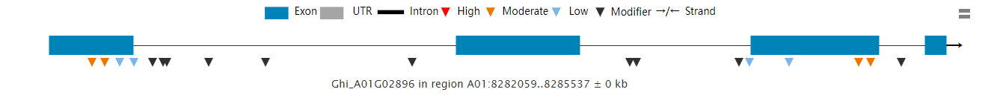

## 浏览器是如何渲染页面的

1. 浏览器载入 HTML 文件。
2. 将 HTML 文件转化成一个 DOM。
3. 接下来，浏览器会拉取该 HTML 相关的大部分资源，比如嵌入到页面的图片、视频和 CSS 样式，js会稍后加载。
4. 浏览器拉取到 CSS 之后会进行解析，根据选择器的不同类型（比如 element、class、id 等等）把他们分到不同的“桶”中。浏览器基于它找到的不同的选择器，将不同的规则（基于选择器的规则，如元素选择器、类选择器、id 选择器等）应用在对应的 DOM 的节点中，并添加节点依赖的样式（这个中间步骤称为渲染树）。
5. 上述的规则应用于渲染树之后，渲染树会依照应该出现的结构进行布局。
6. 网页展示在屏幕上（这一步被称为着色）。


### Critical Rendering Path（CRP）
1. 构建DOM
    * 将HTML解析为许多tokens
    * 将tokens解析为object
    * 将object组合为DOM树
2. 构建CSSOM
    * 解析css文件，构建CSSOM树
3. 构建Render Tree
    * 结合DOM和CSSOM构建Render树
4. Layout
    * 计算出元素相对于viewport的相对位置
5. Paint
    * 将render tree转换为像素显示

上面的过程不是依次进行的，存在一定交叉

#### 构建DOM
HTML很大的时候，一个RTT（Round-Trip time，往返时延）只得到一部分，浏览器会根据这部分进行构建DOM，并不会等到收到整个文档才开始。<strong>而CSSOM需要等到所有字节收到才开始构建。</strong>


#### 构建CSSOM
HTML遇到link标签时，会请求css文件，css文件就位时便开始解析（如果是行内style则直接解析），这一过程和构建DOM同时进行  
上面构建的并不是完整的CSSOM树，除此之外还有浏览器的默认样式，称为user agent styles

#### 构建Render Tree
这一步只构建需要在屏幕上显示的部分，对于<code>display: none;</code>的元素也无需构建

!!!note
    <code>display: none;</code>告诉浏览器这个元素无需出现在render tree中，但是<code>visibility: hidden;</code>只是隐藏了这个元素，但是元素还占空间，会影响到后面的layout，因此仍需要出现在render tree中。

具体步骤：

1. 浏览器从DOM树开始遍历，找到每一个可见节点
2. 对于每一个可见节点，在CSSOM上找到匹配的样式并应用
3. 生成render tree

#### Layout
这一步计算元素相对于viewport的位置和大小，根据计算出的信息，输出元素的box model

#### Paint
浏览器将每一个节点以像素显示在屏幕上，最终看到页面。

#### 引入js
1. 解析HTML构建DOM时，遇到JavaScript会被堵塞
2. JavaScript执行会被CSSOM构建阻塞，JavaScript必须等到CSSOM构建完成后才会执行
3. 使用异步脚本，脚本的网络请求优先级降低，网络请求期间不阻塞DOM构建，直到请求完成后开始执行

## 在线学习网站  

* [菜鸟教程](https://www.runoob.com/)  
* [W3school](https://www.w3school.com.cn/h.asp)  
* [Mozilla 开发者社区](https://developer.mozilla.org/zh-CN/docs/Web)  

## 视频教程  

[黑马前端](https://www.bilibili.com/video/BV14J4114768)  

## 电子书  

[Head First HTML与CSS](https://pan.baidu.com/s/1EeKVMuZWzvHCDw7I6EO0mw) (提取码: eplw)  

## HTML/CSS训练

[freeCodeCamp](https://chinese.freecodecamp.org/learn/responsive-web-design/)  

## 代码编辑

代码编辑器可以使用[Visual Studio Code](https://code.visualstudio.com/),可以安装插件以支持各种编程语言(js、python、R等)语法高亮以及可以安装[remote-ssh](https://marketplace.visualstudio.com/items?itemName=ms-vscode-remote.remote-ssh)以进行ssh远程连接等。

## html标签的类型（head， body，!Doctype） 他们的作用是什么

<code>&lt;!DOCTYPE html&gt;</code>:

* 声明文档类型，早期规定了 HTML 页面必须遵从的良好规则，能自动检测错误和其他有用的东西。目前用处不大。
  
<code>&lt;head&gt;</code>:

* 包含了所有想包含在 HTML 页面中但不想在 HTML 页面中显示的内容, 包括网站标题及图标、meta标签、CSS样式、字符集声明等

<code>&lt;body&gt;</code>:

* 文档主体，页面上显示的内容都包括在这里
* 支持 html 的全局属性和事件属性

## 字符编码

- 编码，字符转换为二进制码
- 解码，二进制码转为字符
- 字符集(charset)，编码和解码采用的规则，常用的字符集
    - ASCII
    - ISO88591
    - GB2312
    - GBK
    - UTF-8

```html
<meta charset="utf-8">
```

## SEO 搜索引擎优化
让网站在搜索引擎上的排名靠前
SEO三大标签
```html
<title>.......</title>
<meta name="description" content="......">
<meta name="keywords" content="keyword1,keyword2...">
```


## 实体(转义字符)

```html
<!-- 
  &实体名; 
  &nbsp; 空格
  &gt; 大于
  &lt; 小于
  &copy; 版权符号
-->
```

## meta标签

```html
<meta name="keywords" content="keyword1,keyword2">
<meta name="description" content="some description">
<!-- 网站重定向, 3表示3秒后跳转 -->
<meta name="refresh" content="3;url=http://www.mydomain.com">
```

## 语义化标签

### hgroup
```html
<!-- 将一组相关的标题放入hgroup -->
<hgroup>
  <h1></h1>
  <h2></h2>
</hgroup>
```

### em
表示语音语调的加重

### strong
表示强调

### blockquota
表示长引用

### q
表示短引用

### header
表示网页的头部

### main
网页的主体(一个页面只有一个)

### footer
网页的底部

### nav
网页中的导航

### aside
和主体相关的其他内容(侧边栏)

### article
表示独立的文章

### section
表示独立的区块，上面的标签都不能表示时使用section

### 定义列表
```html
<dl>
  <dt>结构</dt>
  <dd>结构表示网页的结构,......</dd>
  <dd>结构用来规定网页中......</dd>
</dl>
```

## html5的新特性

### 新增选择器

<code>document.querySelector()</code>、<code>document.querySelectorAll()</code>

用法见[javaScript](/js/js/#_9)

### 拖拽释放(Drag and drop)API

<style>
  #drop_box{
    width: 350px;
    height: 70px;
    padding: 10px;
    border: 1px solid #aaaaaa;
  }
</style>
<div>
  <div id="drop_box" ondragover="allowDrop(event)" ondrop="drop(event)"></div>
  
</div>
<script>
  function drag(event) {
    event.dataTransfer.setData('Text', event.target.id)
  }
  function allowDrop(event) {
    event.preventDefault()
  }
  function drop(event) {
    event.preventDefault()
    let data = event.dataTransfer.getData('Text')
    event.target.appendChild(document.getElementById(data))
  }
</script>

```html
<style>
  #drop_box{
    width: 350px;
    height: 70px;
    padding: 10px;
    border: 1px solid #aaaaaa;
  }
</style>
<div>
  <div id="drop_box" ondragover="allowDrop(event)" ondrop="drop(event)"></div>
  <!-- draggable标识元素是否允许使用拖放操作，默认值为auto，必须显式指定值为true或者false -->
  
</div>
<script>
  // 当用户开始拖动元素或文本选择时，将触发该事件
  function drag(event) {
    // dataTransfer用于保存拖放操作期间正在拖动的数据
    // 将要存放的图片的id以text格式存储起来
    event.dataTransfer.setData('Text', event.target.id)
  }
  function allowDrop(event) {
    // 默认地，无法将数据/元素放置到其他元素中
    event.preventDefault()
  }
  // 当放置被拖数据时，会发生 drop 事件。
  function drop(event) {
    event.preventDefault()
    let data = event.dataTransfer.getData('Text') //获取之前存储的ID
    event.target.appendChild(document.getElementById(data))
  }
</script>
```

### 媒体播放的 &lt;video&gt; 和 &lt;audio&gt;

```html
<!-- 视频 -->
<!-- 
  autoplay 自动播放 
  loop 循环播放
-->
<video width="320" height="240" controls autoplay loop>
  <source src="movie.mp4" type="video/mp4">
  <source src="movie.ogg" type="video/ogg">
  您的浏览器不支持Video标签。
</video>
<script>
  let myVideo = document.querySelector('video')
  myVideo.play() //播放
  myVideo.pause() //暂停
  myVideo.width = 500 //修改大小
</script>
<!-- 音频 -->
<audio controls>
  <source src="horse.ogg" type="audio/ogg">
  <source src="horse.mp3" type="audio/mpeg">
  您的浏览器不支持 audio 元素。
</audio>
```

### 本地存储 <code>localStorage</code> 和 <code>sessionStorage</code>

见[JavaScript](/js/js/#_10)

### 离线应用 Cache Manifest

通过创建 cache manifest 文件，可以创建 web 应用的离线版本

```html
<html manifest="demo.appcache">
  ...
</html>
```

### 桌面通知 Notifications

```js
//先请求适当的权限
Notification.requestPermission(function(status) {
  console.log(status) // 值为"granted"时显示通知
  let n = new Notification('my notification title', { body: 'my notification body' })
})
```

### 语义化标签

* &lt;header&gt;  
* &lt;nav&gt;  
* &lt;section&gt;  
* &lt;article&gt;  
* &lt;aside&gt;  
* &lt;figcaption&gt;: 标签定义 &lt;figure&gt; 元素的标题  
* &lt;figure&gt;: 规定独立的流内容（图像、图表、照片、代码等等）  
* &lt;footer&gt;  

```html
<title>      <!--：页面主体内容。-->
<hn>         <!--：h1~h6，分级标题，<h1> 与 <title> 协调有利于搜索引擎优化。-->
<ul>         <!--：无序列表。-->
<ol>         <!--：有序列表。-->
<header>     <!--：页眉通常包括网站标志、主导航、全站链接以及搜索框。-->
<nav>        <!--：标记导航，仅对文档中重要的链接群使用。-->
<main>       <!--：页面主要内容，一个页面只能使用一次。如果是web应用，则包围其主要功能。-->
<article>    <!--：定义外部的内容，其中的内容独立于文档的其余部分。-->
<section>    <!--：定义文档中的节（section、区段）。比如章节、页眉、页脚或文档中的其他部分。-->
<aside>      <!--：定义其所处内容之外的内容。如侧栏、文章的一组链接、广告、友情链接、相关产品列表等。-->
<footer>     <!--：页脚，只有当父级是body时，才是整个页面的页脚。-->
<small>      <!--：呈现小号字体效果，指定细则，输入免责声明、注解、署名、版权。-->
<strong>     <!--：和 em 标签一样，用于强调文本，但它强调的程度更强一些。-->
<em>         <!--：将其中的文本表示为强调的内容，表现为斜体。-->
<mark>       <!--：使用黄色突出显示部分文本。-->
<figure>     <!--：规定独立的流内容（图像、图表、照片、代码等等）（默认有40px左右margin）。-->
<figcaption> <!--：定义 figure 元素的标题，应该被置于 figure 元素的第一个或最后一个子元素的位置。-->
<cite>       <!--：表示所包含的文本对某个参考文献的引用，比如书籍或者杂志的标题。-->
<blockquoto> <!--：定义块引用，块引用拥有它们自己的空间。-->
<q>          <!--：短的引述（跨浏览器问题，尽量避免使用）。-->
<time>       <!--：datetime属性遵循特定格式，如果忽略此属性，文本内容必须是合法的日期或者时间格式。-->
<abbr>       <!--：简称或缩写。-->
<dfn>        <!--：定义术语元素，与定义必须紧挨着，可以在描述列表dl元素中使用。-->
<address>    <!--：作者、相关人士或组织的联系信息（电子邮件地址、指向联系信息页的链接）。-->
<del>        <!--：移除的内容。-->
<ins>        <!--：添加的内容。-->
<code>       <!--：标记代码。-->
<meter>      <!--：定义已知范围或分数值内的标量测量。（Internet Explorer 不支持 meter 标签）-->
<progress>   <!--：定义运行中的进度（进程）。-->
```

### 新表单元素

* &lt;datalist&gt;
  ```html
  <input list="browsers">
 
  <datalist id="browsers">
    <option value="Internet Explorer">
    <option value="Firefox">
    <option value="Chrome">
    <option value="Opera">
    <option value="Safari">
  </datalist>
  ```
  示例：
  <div>
    <input list="browsers" style="border: 1px solid black;">
  
    <datalist id="browsers">
      <option value="Internet Explorer">
      <option value="Firefox">
      <option value="Chrome">
      <option value="Opera">
      <option value="Safari">
    </datalist>
  </div>
* &lt;output&gt;
  ```html
  <form oninput="result.value=parseInt(a.value)+parseInt(b.value)">
    <input type="range" name="b" value="50" /> +
    <input type="number" name="a" value="10" /> =
    <output name="result"></output>
  </form>
  ```
  <form oninput="result.value=parseInt(a.value)+parseInt(b.value)">
    <input type="range" name="b" value="50" /> +
    <input type="number" name="a" value="10" style="border: 1px solid black;"/> =
    <output name="result"></output>
  </form>

### Geolocation（地理定位）

Navigator 对象的实例是唯一的，可以用 Window 对象的 navigator 属性来引用它
```html
<div>
  <p id="navigator_demo">点击按钮获取当前坐标</p>
  <button id="getLocationButton">获取坐标</button>
</div>

<script>
  let container = document.querySelector('#navigator_demo')
  let button = document.querySelector('#getLocationButton')
  button.addEventListener('click', () => {
    if (navigator.geolocation) {
      navigator.geolocation.getCurrentPosition(showPosition, showError)
    } else {
      container.innerText = "该浏览器不支持获取地理位置"
    }
  })
  function showPosition(position) {
    container.innerText = `纬度: ${position.coords.latitude}, 经度: ${position.coords.longitude}`
  }
  function showError(error) {
    switch(error.code)
    {
      case error.PERMISSION_DENIED:
        container.innerHTML="用户拒绝对获取地理位置的请求。"
        break;
      case error.POSITION_UNAVAILABLE:
        container.innerHTML="位置信息是不可用的。"
        break;
      case error.TIMEOUT:
        container.innerHTML="请求用户地理位置超时。"
        break;
      case error.UNKNOWN_ERROR:
        container.innerHTML="未知错误。"
        break;
    }
  }
</script>
```
<div>
  <p id="navigator_demo">点击按钮获取当前坐标</p>
  <button id="getLocationButton" style="border: 1px solid black;cursor: pointer;">获取坐标</button>
</div>

<script>
  let container = document.querySelector('#navigator_demo')
  let button = document.querySelector('#getLocationButton')
  button.addEventListener('click', () => {
    if (navigator.geolocation) {
      navigator.geolocation.getCurrentPosition(showPosition, showError)
    } else {
      container.innerText = "该浏览器不支持获取地理位置"
    }
  })
  function showPosition(position) {
    container.innerText = `纬度: ${position.coords.latitude}, 经度: ${position.coords.longitude}`
  }
  function showError(error) {
    switch(error.code)
    {
      case error.PERMISSION_DENIED:
        container.innerHTML="用户拒绝对获取地理位置的请求。"
        break;
      case error.POSITION_UNAVAILABLE:
        container.innerHTML="位置信息是不可用的。"
        break;
      case error.TIMEOUT:
        container.innerHTML="请求用户地理位置超时。"
        break;
      case error.UNKNOWN_ERROR:
        container.innerHTML="未知错误。"
        break;
    }
  }
</script>

### 多任务 webworker

见[JavaScript](/js/js/#workers)

### 全双工通信协议 websocket

具体见[菜鸟教程](https://www.runoob.com/html/html5-websocket.html)

### 页面可见性改变事件 visibilitychange

```js
// 在文档可见时开始播放音乐曲目，在文档不再可见时暂停音乐
document.addEventListener('visibilitychange', function() {
  // document.visibilityState:
  // 1. visible 页面内容至少是部分可见;
  // 2. hidden 文档处于背景标签页或者窗口处于最小化,或者操作系统正处于 '锁屏状态';
  // 3. prerender 页面此时正在渲染中
  if (document.visibilityState === 'visible') {
    backgroundMusic.play()
  } else {
    backgroundMusic.pause()
  }
})
```

### 跨窗口通信 PostMessage

对于两个不同页面的脚本，只有当执行它们的页面位于具有相同的协议（通常为 https），端口号（443 为 https 的默认值），以及主机  (两个页面的模数 Document.domain设置为相同的值) 时，这两个脚本才能相互通信。
```js
// A窗口的域名为www.myDomain.com/A
// 以下是 A 窗口的 script 标签下的代码
let popup = window.open('www.myDomain.com/B')
popup.postMessage("hello there!", "www.myDomain.com/B")

// B窗口的域名为www.myDomain.com/b
// 以下是 B 窗口的 script 标签下的代码
window.addEventListener('message', function(event) {
  if (event.origin !== 'www.myDomain.com') {
    return
  }
  event.source.postMessage("hi there yourself!", "www.myDomain.com/A") //回信
})
```