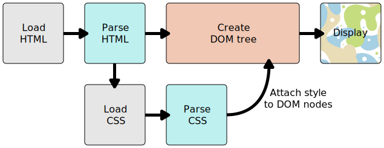

## 浏览器是如何渲染页面的

1. 浏览器载入 HTML 文件。
2. 将 HTML 文件转化成一个 DOM。
3. 接下来，浏览器会拉取该 HTML 相关的大部分资源，比如嵌入到页面的图片、视频和 CSS 样式，js会稍后加载。
4. 浏览器拉取到 CSS 之后会进行解析，根据选择器的不同类型（比如 element、class、id 等等）把他们分到不同的“桶”中。浏览器基于它找到的不同的选择器，将不同的规则（基于选择器的规则，如元素选择器、类选择器、id 选择器等）应用在对应的 DOM 的节点中，并添加节点依赖的样式（这个中间步骤称为渲染树）。
5. 上述的规则应用于渲染树之后，渲染树会依照应该出现的结构进行布局。
6. 网页展示在屏幕上（这一步被称为着色）。

## 在线学习网站  

* [菜鸟教程](https://www.runoob.com/)  
* [W3school](https://www.w3school.com.cn/h.asp)  
* [Mozilla 开发者社区](https://developer.mozilla.org/zh-CN/docs/Web)  

## 视频教程  

[黑马前端](https://www.bilibili.com/video/BV14J4114768)  

## 电子书  

[Head First HTML与CSS](https://pan.baidu.com/s/1EeKVMuZWzvHCDw7I6EO0mw) (提取码: eplw)  

## HTML/CSS训练

[freeCodeCamp](https://chinese.freecodecamp.org/learn/responsive-web-design/)  

## 代码编辑

代码编辑器可以使用[Visual Studio Code](https://code.visualstudio.com/),可以安装插件以支持各种编程语言(js、python、R等)语法高亮以及可以安装[remote-ssh](https://marketplace.visualstudio.com/items?itemName=ms-vscode-remote.remote-ssh)以进行ssh远程连接等。
    
!!! note
    了解基础标签的用法即可，后续学习将会一直使用，在此期间可以继续熟悉其用法。