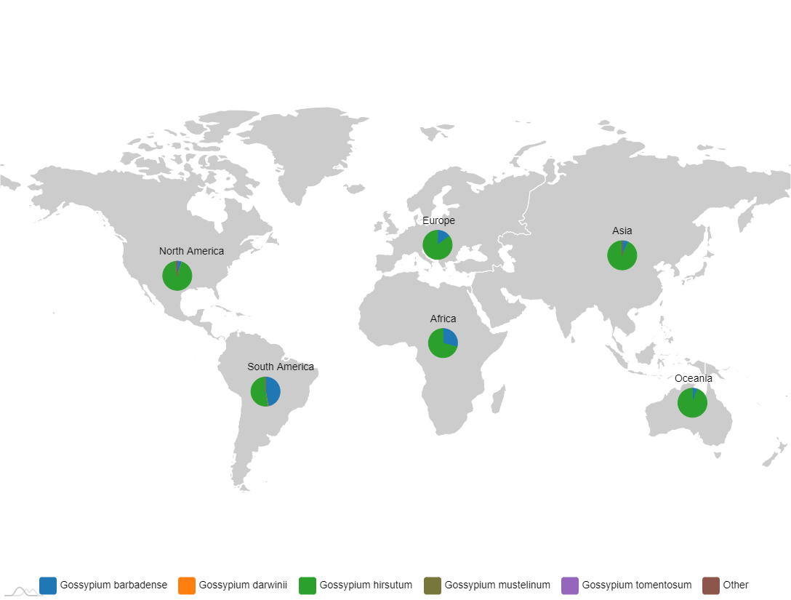

## amCharts介绍

[amCharts](https://www.amcharts.com/)与Echarts类似，也可以绘制各种基本图形。这里主要使用其中的[amCharts Maps](https://www.amcharts.com/demos/map-dynamic-pie-charts/)绘制地图。

## 带饼图的世界地图



=== "JavaScript"

    ```html
    <script type="text/javascript" charset="utf8" src="http://code.jquery.com/jquery-1.10.2.min.js"></script>
    <script src="https://cdn.amcharts.com/lib/4/core.js"></script>
    <script src="https://cdn.amcharts.com/lib/4/charts.js"></script>
    <script src="https://cdn.amcharts.com/lib/4/maps.js"></script>
    <script src="https://cdn.amcharts.com/lib/4/geodata/continentsLow.js"></script>
    <!-- 可挑选主题颜色，也可以直接修改js文件中的颜色 -->
    <script src="https://cdn.amcharts.com/lib/4/themes/spiritedaway.js"></script>
    <script src="https://cdn.amcharts.com/lib/4/themes/animated.js"></script>

    <div id="chartdiv" style="width: 1088px;height:825px;"></div>

    <script>
    $(document).ready(function() {
      //准备所需数据
      var as = [
        {
          category: 'Gossypium barbadense',
          value: 187
        },
        {
          category: 'Gossypium darwinii',
          value: 0
        },
        {
          category: 'Gossypium hirsutum',
          value: 2531
        },
        {
          category: 'Gossypium mustelinum',
          value: 0
        },
        {
          category: 'Gossypium tomentosum',
          value: 0
        },
        {
          category: 'Other',
          value: 5
        }
      ]
      var eu = [
        {
          category: 'Gossypium barbadense',
          value: 21
        },
        {
          category: 'Gossypium darwinii',
          value: 0
        },
        {
          category: 'Gossypium hirsutum',
          value: 120
        },
        {
          category: 'Gossypium mustelinum',
          value: 0
        },
        {
          category: 'Gossypium tomentosum',
          value: 0
        },
        {
          category: 'Other',
          value: 0
        }
      ]
      var no = [
        {
          category: 'Gossypium barbadense',
          value: 2
        },
        {
          category: 'Gossypium darwinii',
          value: 0
        },
        {
          category: 'Gossypium hirsutum',
          value: 34
        },
        {
          category: 'Gossypium mustelinum',
          value: 0
        },
        {
          category: 'Gossypium tomentosum',
          value: 0
        },
        {
          category: 'Other',
          value: 0
        }
      ]
      var so = [
        {
          category: 'Gossypium barbadense',
          value: 38
        },
        {
          category: 'Gossypium darwinii',
          value: 1
        },
        {
          category: 'Gossypium hirsutum',
          value: 675
        },
        {
          category: 'Gossypium mustelinum',
          value: 1
        },
        {
          category: 'Gossypium tomentosum',
          value: 1
        },
        {
          category: 'Other',
          value: 10
        }
      ]
      var af = [
        {
          category: 'Gossypium barbadense',
          value: 96
        },
        {
          category: 'Gossypium darwinii',
          value: 1
        },
        {
          category: 'Gossypium hirsutum',
          value: 106
        },
        {
          category: 'Gossypium mustelinum',
          value: 1
        },
        {
          category: 'Gossypium tomentosum',
          value: 0
        },
        {
          category: 'Other',
          value: 0
        }
      ]
      var oc = [
        {
          category: 'Gossypium barbadense',
          value: 24
        },
        {
          category: 'Gossypium darwinii',
          value: 0
        },
        {
          category: 'Gossypium hirsutum',
          value: 58
        },
        {
          category: 'Gossypium mustelinum',
          value: 0
        },
        {
          category: 'Gossypium tomentosum',
          value: 0
        },
        {
          category: 'Other',
          value: 0
        }
      ]
      draw(as, eu, so, no, af, oc);
    });
    function draw(as, eu, so, no, af, oc) {
      am4core.ready(function() {
        // Themes begin, 根据引入的主题js文件改变主题颜色
        am4core.useTheme(am4themes_spiritedaway);
        //am4core.useTheme(am4themes_kelly);
        // Themes end

        // Create map instance
        var chart = am4core.create("chartdiv", am4maps.MapChart);

        // Set map definition
        chart.geodata = am4geodata_continentsLow;

        // Set projection
        chart.projection = new am4maps.projections.Miller();
        chart.exporting.menu = new am4core.ExportMenu();
        chart.exporting.menu.items = [{
          "label": "...",
          "menu": [
            { "type": "png", "label": "PNG" },
          ]
        }];

        chart.exporting.timeoutDelay = 5000;
        // Create map polygon series
        var polygonSeries = chart.series.push(new am4maps.MapPolygonSeries());
        polygonSeries.exclude = ["antarctica"];
        polygonSeries.mapPolygons.template.fill = '#CCCCCC';
        polygonSeries.mapPolygons.template.nonScalingStroke = false;
        polygonSeries.useGeodata = true;

        // Create an image series that will hold pie charts
        var pieSeries = chart.series.push(new am4maps.MapImageSeries());
        var pieTemplate = pieSeries.mapImages.template;
        pieTemplate.propertyFields.latitude = "latitude";
        pieTemplate.propertyFields.longitude = "longitude";

        var pieChartTemplate = pieTemplate.createChild(am4charts.PieChart);
        pieChartTemplate.adapter.add("data", function(data, target) {
          if (target.dataItem) {
            return target.dataItem.dataContext.pieData;
          }
          else {
            return [];
          }
        });
        pieChartTemplate.propertyFields.width = "width";
        pieChartTemplate.propertyFields.height = "height";
        pieChartTemplate.horizontalCenter = "middle";
        pieChartTemplate.verticalCenter = "middle";

        var pieTitle = pieChartTemplate.titles.create();
        pieTitle.text = "{title}";

        var pieSeriesTemplate = pieChartTemplate.series.push(new am4charts.PieSeries);
        pieSeriesTemplate.dataFields.category = "category";
        pieSeriesTemplate.dataFields.value = "value";
        pieSeriesTemplate.labels.template.disabled = true;
        pieSeriesTemplate.ticks.template.disabled = true;

        pieSeries.data = [{
          "title": "North America",
          "latitude": 39.563353,
          "longitude": -99.316406,
          "width": 50,
          "height": 50,
          "pieData": no
        }, {
          "title": "South America",
          "latitude": -10.896104,
          "longitude": -59.160156,
          "width": 50,
          "height": 50,
          "pieData": so
        }, {
          "title": "Oceania",
          "latitude": -15.896104,
          "longitude": 135.160156,
          "width": 50,
          "height": 50,
          "pieData": oc
        }, {
          "title": "Europe",
          "latitude": 50.896104,
          "longitude": 19.160156,
          "width": 50,
          "height": 50,
          "pieData": eu
        }, {
          "title": "Asia",
          "latitude": 47.212106,
          "longitude": 103.183594,
          "width": 50,
          "height": 50,
          "pieData": as
        }, {
          "title": "Africa",
          "latitude": 11.081385,
          "longitude": 21.621094,
          "width": 50,
          "height": 50,
          "pieData": af
        }];
        var legendDataMap = {};
        var legendData = [];
        var count = 0;

        // legend for pie slices
        pieSeriesTemplate.events.on("datavalidated", function(event) {
          event.target.dataItems.each(function(dataItem) {
            if (!legendDataMap[dataItem.category]) {
              legendDataMap[dataItem.category] = dataItem;
              legendData.push(dataItem);
            }
          })
          count++
          if (count == pieSeriesTemplate.clones.length) {
            createLegend(legendData);
            count = 0;
            legendDataMap = {};
            legendData = [];
          }
        })

        var legend;
        function createLegend(data) {
          if (!legend) {
            legend = chart.createChild(am4charts.Legend)
          }
          legend.valueLabels.template.disabled = true; // disabling because it would only show one legend values
          legend.data = data;
          legend.dataFields.name = "category";
          legend.valign = 'bottom';
          // make this legend to toggle all the slices
          legend.itemContainers.template.events.on("toggled", function(event) {
            let category = event.target.dataItem.dataContext.category;
            // do it for all clones
            pieSeriesTemplate.clones.each(function(pieSeries) {
              if (pieSeries != event.target.dataItem.dataContext.component) {
                pieSeries.dataItems.each(function(dataItem) {
                  if (dataItem.category == category) {
                    if (event.target.isActive) {
                      dataItem.hide();
                    }
                    else {
                      dataItem.show();
                    }
                  }
                })
              }
            })
          })
        }
      }); // end am4core.ready()
    }
    </script>
    ```

=== "Vue"

    ```html
    <!-- npm install @amcharts/amcharts4 -->
    <!-- npm install @amcharts/amcharts4-geodata -->
    <template>
      <div>
        <div :ref="chartID" :id="chartID" style="width: 100%;height: 600px;"></div>
      </div>
    </template>
    <script>
      import * as am4core from '@amcharts/amcharts4/core'
      import * as am4charts from '@amcharts/amcharts4/charts'
      import * as am4maps from '@amcharts/amcharts4/maps'
      import am4geodata_continentsLow from '@amcharts/amcharts4-geodata/continentsLow'
      import am4themes_animated from '@amcharts/amcharts4/themes/animated'

      am4core.useTheme(am4themes_animated)

      export default {
        name: 'geomap',
        data() {
          return {
            mapData: {
              North_America: [
                { category: 'Gossypium hirsutum', value: 675 },
                { category: 'Gossypium barbadense', value: 38 },
                { category: 'Gossypium tomentosum', value: 1 },
                { category: 'Gossypium darwinii', value: 1 },
                { category: 'Gossypium mustelinum', value: 1 },
                { category: 'Other', value: 10 }
              ],
              South_America: [
                { category: 'Gossypium hirsutum', value: 106 },
                { category: 'Gossypium barbadense', value: 96 },
                { category: 'Gossypium tomentosum', value: 0 },
                { category: 'Gossypium darwinii', value: 1 },
                { category: 'Gossypium mustelinum', value: 1 },
                { category: 'Other', value: 0 }
              ],
              Oceania: [
                { category: 'Gossypium hirsutum', value: 34 },
                { category: 'Gossypium barbadense', value: 2 },
                { category: 'Gossypium tomentosum', value: 0 },
                { category: 'Gossypium darwinii', value: 0 },
                { category: 'Gossypium mustelinum', value: 0 },
                { category: 'Other', value: 0 }
              ],
              Europe: [
                { category: 'Gossypium hirsutum', value: 120 },
                { category: 'Gossypium barbadense', value: 21 },
                { category: 'Gossypium tomentosum', value: 0 },
                { category: 'Gossypium darwinii', value: 0 },
                { category: 'Gossypium mustelinum', value: 0 },
                { category: 'Other', value: 0 }
              ],
              Asia: [
                { category: 'Gossypium hirsutum', value: 2531 },
                { category: 'Gossypium barbadense', value: 187 },
                { category: 'Gossypium tomentosum', value: 0 },
                { category: 'Gossypium darwinii', value: 0 },
                { category: 'Gossypium mustelinum', value: 0 },
                { category: 'Other', value: 5 }
              ],
              Africa: [
                { category: 'Gossypium hirsutum', value: 58 },
                { category: 'Gossypium barbadense', value: 24 },
                { category: 'Gossypium tomentosum', value: 0 },
                { category: 'Gossypium darwinii', value: 0 },
                { category: 'Gossypium mustelinum', value: 0 },
                { category: 'Other', value: 0 }
              ]
            }
          }
        },
        mounted() {
          let chart = am4core.create('chartdiv', am4maps.MapChart)

          // Set map definition
          chart.geodata = am4geodata_continentsLow

          // Set projection
          chart.projection = new am4maps.projections.Miller()
          chart.exporting.menu = new am4core.ExportMenu()
          chart.exporting.menu.items = [
            {
              label: '...',
              menu: [{ type: 'png', label: 'PNG' }]
            }
          ]

          // Create map polygon series
          let polygonSeries = chart.series.push(new am4maps.MapPolygonSeries())
          polygonSeries.exclude = ['antarctica']
          polygonSeries.mapPolygons.template.fill = '#CCCCCC'
          polygonSeries.mapPolygons.template.nonScalingStroke = false
          polygonSeries.useGeodata = true

          // Create an image series that will hold pie charts
          let pieSeries = chart.series.push(new am4maps.MapImageSeries())
          let pieTemplate = pieSeries.mapImages.template
          pieTemplate.propertyFields.latitude = 'latitude'
          pieTemplate.propertyFields.longitude = 'longitude'

          let pieChartTemplate = pieTemplate.createChild(am4charts.PieChart)
          pieChartTemplate.adapter.add('data', function(data, target) {
            if (target.dataItem) {
              return target.dataItem.dataContext.pieData
            } else {
              return []
            }
          })
          pieChartTemplate.propertyFields.width = 'width'
          pieChartTemplate.propertyFields.height = 'height'
          pieChartTemplate.horizontalCenter = 'middle'
          pieChartTemplate.verticalCenter = 'middle'

          let pieTitle = pieChartTemplate.titles.create()
          pieTitle.text = '{title}'

          let pieSeriesTemplate = pieChartTemplate.series.push(
            new am4charts.PieSeries()
          )
          pieSeriesTemplate.dataFields.category = 'category'
          pieSeriesTemplate.dataFields.value = 'value'
          pieSeriesTemplate.labels.template.disabled = true
          pieSeriesTemplate.ticks.template.disabled = true

          pieSeries.data = [
            {
              title: 'North America',
              latitude: 39.563353,
              longitude: -99.316406,
              width: 50,
              height: 50,
              pieData: this.mapData.North_America
            },
            {
              title: 'South America',
              latitude: -10.896104,
              longitude: -59.160156,
              width: 50,
              height: 50,
              pieData: this.mapData.South_America
            },
            {
              title: 'Oceania',
              latitude: -15.896104,
              longitude: 135.160156,
              width: 50,
              height: 50,
              pieData: this.mapData.Oceania
            },
            {
              title: 'Europe',
              latitude: 50.896104,
              longitude: 19.160156,
              width: 50,
              height: 50,
              pieData: this.mapData.Europe
            },
            {
              title: 'Asia',
              latitude: 47.212106,
              longitude: 103.183594,
              width: 50,
              height: 50,
              pieData: this.mapData.Asia
            },
            {
              title: 'Africa',
              latitude: 11.081385,
              longitude: 21.621094,
              width: 50,
              height: 50,
              pieData: this.mapData.Africa
            }
          ]
          var legendDataMap = {}
          var legendData = []
          var count = 0

          // legend for pie slices
          pieSeriesTemplate.events.on('datavalidated', function(event) {
            event.target.dataItems.each(function(dataItem) {
              if (!legendDataMap[dataItem.category]) {
                legendDataMap[dataItem.category] = dataItem
                legendData.push(dataItem)
              }
            })
            count++
            if (count == pieSeriesTemplate.clones.length) {
              createLegend(legendData)
              count = 0
              legendDataMap = {}
              legendData = []
            }
          })

          var legend
          function createLegend(data) {
            if (!legend) {
              legend = chart.createChild(am4charts.Legend)
            }

            legend.valueLabels.template.disabled = true // disabling because it would only show one legend values
            legend.data = data
            legend.dataFields.name = 'category'
            legend.valign = 'bottom'
            // make this legend to toggle all the slices
            legend.itemContainers.template.events.on('toggled', function(event) {
              let category = event.target.dataItem.dataContext.category
              // do it for all clones
              pieSeriesTemplate.clones.each(function(pieSeries) {
                if (pieSeries != event.target.dataItem.dataContext.component) {
                  pieSeries.dataItems.each(function(dataItem) {
                    if (dataItem.category == category) {
                      if (event.target.isActive) {
                        dataItem.hide()
                      } else {
                        dataItem.show()
                      }
                    }
                  })
                }
              })
            })
          }
        },

        beforeDestroy() {
          if (this.chart) {
            this.chart.dispose()
          }
        }
      }
      </script>
    ```