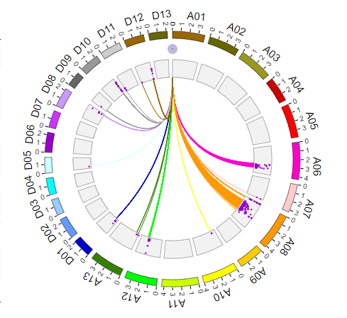

官网: <http://bioinfo.ibp.ac.cn/biocircos/>

## 示例
  


=== "JavaScript"

    ```html
    <script type="text/javascript" charset="utf8" src="http://code.jquery.com/jquery-1.10.2.min.js"></script>
    <script type="text/javascript" charset="utf8" src="http://yanglab.hzau.edu.cn/static/js/biocircos/d3.js"></script>
    <script type="text/javascript" charset="utf8" src="http://yanglab.hzau.edu.cn/static/js/biocircos/biocircos-1.0.0.js"></script>

    <div id="biocircos"></div>

    <script>
      $(document).ready(function() {
        //snp
        var snp = [{ "chr": "A06", "pos": 80162862, "value": 4.597351e-9 }, { "chr": "A06", "pos": 80382049, "value": 2.512427e-18 }, { "chr": "A06", "pos": 80382082, "value": 7.497095e-11 }, { "chr": "A06", "pos": 80816183, "value": 4.830162e-7 }, { "chr": "A06", "pos": 81573164, "value": 3.202536e-7 }, { "chr": "A06", "pos": 82262582, "value": 9.473178e-13 }, { "chr": "A06", "pos": 82262615, "value": 6.441989e-12 }];
        //gene
        var gene = [{ "chr": "A01", "start": 268599, "end": 269169, "name": "Ghi_A01G00146", "des": "gene" }];
        //eQTL
        var links = {
          link_A06: [{ "fusion": "GhiA06080162862SNV--Ghi_A01G00146", "g1chr": "A06", "g1start": 80162862, "g1end": 80162862, "g1name": "GhiA06080162862SNV", "g2chr": "A01", "g2start": 268599, "g2end": 269169, "g2name": "Ghi_A01G00146" }],
          link_A13: [{ "fusion": "GhiA13001987716SNV--Ghi_A01G00146", "g1chr": "A13", "g1start": 1987716, "g1end": 1987716, "g1name": "GhiA13001987716SNV", "g2chr": "A01", "g2start": 268599, "g2end": 269169, "g2name": "Ghi_A01G00146" }, { "fusion": "GhiA13013198950SNV--Ghi_A01G00146", "g1chr": "A13", "g1start": 13198950, "g1end": 13198950, "g1name": "GhiA13013198950SNV", "g2chr": "A01", "g2start": 268599, "g2end": 269169, "g2name": "Ghi_A01G00146" }]
        }
        //染色体名以及长度
        var BioCircosGenome = [
          ["A01", 112029331],
          ["A02", 106041875],
          ["A03", 116396180],
          ["A04", 85730437],
          ["A05", 115727996],
          ["A06", 128492809],
          ["A07", 97995491],
          ["A08", 126020840],
          ["A09", 86502437],
          ["A10", 121967758],
          ["A11", 127558678],
          ["A12", 111633091],
          ["A13", 112716876],
          ["D01", 63508995],
          ["D02", 71698750],
          ["D03", 56140004],
          ["D04", 57942221],
          ["D05", 54532635],
          ["D06", 68799799],
          ["D07", 59181855],
          ["D08", 66890076],
          ["D09", 50155903],
          ["D10", 68123451],
          ["D11", 72227647],
          ["D12", 68832472],
          ["D13", 64550653]
        ];
        var BACKGROUND01 = ["BACKGROUND01", {
          BginnerRadius: 140,
          BgouterRadius: 115,
          BgFillColor: "#F2F2F2",
          BgborderColor: "#000",
          BgborderSize: 0.3
        }];
        var SNP01 = ["SNP01", {
          maxRadius: 138,
          minRadius: 117,
          SNPFillColor: "#9400D3",
          PointType: "rect",
          circleSize: 2,
          displaySNPAxis: false,
          SNPAxisColor: "#B8B8B8",
          SNPAxisWidth: 0.5
        }, snp
        ];
        var SCATTER01 = ["SCATTER01", {
          SCATTERRadius: 155,
          innerCircleSize: 1,
          outerCircleSize: 7,
          innerCircleColor: "#7876B1",
          outerCircleColor: "#7876B1",
          random_data: 0
        }, gene
        ];
        //按染色体不同,绘制不同颜色的link
        var LINK01 = ["LINK01", {
          LinkRadius: 115,
          LinkFillColor: "#996600",
          LinkWidth: 1,
          displayLinkAxis: false,
          LinkAxisColor: "#B8B8B8",
          LinkAxisWidth: 0.5,
          LinkAxisPad: 3,
          displayLinkLabel: false,
          LinkLabelColor: "red",
          LinkLabelSize: 13,
          LinkLabelPad: 8,
        }, []
        ];
        function create_link(orign, copied, color, link) {
          var temp = $.extend(true, {}, orign);
          temp[0] = copied;
          temp[1]['LinkFillColor'] = color;
          if (link) {
            temp[2] = link;
          } else {
            temp[2] = [];
          }
          return temp;
        }
        if (links['link_A01']) {
          LINK01[2] = links['link_A01'];
        }
        LINK02 = create_link(LINK01, 'LINK02', '#666600', links['link_A02']);
        LINK03 = create_link(LINK01, 'LINK03', '#99991E', links['link_A03']);
        LINK04 = create_link(LINK01, 'LINK04', '#CC0000', links['link_A04']);
        LINK05 = create_link(LINK01, 'LINK05', '#FF0000', links['link_A05']);
        LINK06 = create_link(LINK01, 'LINK06', '#FF00CC', links['link_A06']);
        LINK07 = create_link(LINK01, 'LINK07', '#FFCCCC', links['link_A07']);
        LINK08 = create_link(LINK01, 'LINK08', '#FF9900', links['link_A08']);
        LINK09 = create_link(LINK01, 'LINK09', '#FFCC00', links['link_A09']);
        LINK10 = create_link(LINK01, 'LINK10', '#FFFF00', links['link_A10']);
        LINK11 = create_link(LINK01, 'LINK11', '#CCFF00', links['link_A11']);
        LINK12 = create_link(LINK01, 'LINK12', '#00FF00', links['link_A12']);
        LINK13 = create_link(LINK01, 'LINK13', '#358000', links['link_A13']);
        LINK14 = create_link(LINK01, 'LINK14', '#0000CC', links['link_D01']);
        LINK15 = create_link(LINK01, 'LINK15', '#6699FF', links['link_D02']);
        LINK16 = create_link(LINK01, 'LINK16', '#99CCFF', links['link_D03']);
        LINK17 = create_link(LINK01, 'LINK17', '#00FFFF', links['link_D04']);
        LINK18 = create_link(LINK01, 'LINK18', '#CCFFFF', links['link_D05']);
        LINK19 = create_link(LINK01, 'LINK19', '#9900CC', links['link_D06']);
        LINK20 = create_link(LINK01, 'LINK20', '#CC33FF', links['link_D07']);
        LINK21 = create_link(LINK01, 'LINK21', '#CC99FF', links['link_D08']);
        LINK22 = create_link(LINK01, 'LINK22', '#666666', links['link_D09']);
        LINK23 = create_link(LINK01, 'LINK23', '#999999', links['link_D10']);
        LINK24 = create_link(LINK01, 'LINK24', '#CCCCCC', links['link_D11']);
        LINK25 = create_link(LINK01, 'LINK25', '#996600', links['link_D12']);
        LINK26 = create_link(LINK01, 'LINK26', '#666600', links['link_D13']);
        BioCircos01 = new BioCircos(LINK01, LINK02, LINK03, LINK04, LINK05, LINK06, LINK07,
          LINK08, LINK09, LINK10, LINK11, LINK12, LINK13, LINK14, LINK15, LINK16, LINK17, LINK18, LINK19,
          LINK20, LINK21, LINK22, LINK23, LINK24, LINK25, LINK26, BACKGROUND01, SNP01, SCATTER01, BioCircosGenome, {
          target: "biocircos",
          svgWidth: 600,
          svgHeight: 450,
          chrPad: 0.04,
          innerRadius: 170,
          outerRadius: 180,
          ARCMouseOnDisplay: true,
          SNPMouseOnDisplay: true,
          LINKMouseOnDisplay: true
        });
        BioCircos01.draw_genome(BioCircos01.genomeLength);
      })
    </script>
    ```

=== "Vue"

    !!! Tip
        以下示例中, biocircos-vue.js存放在public/js中。  
        biocircos-vue.js文件使用<http://yanglab.hzau.edu.cn/static/js/biocircos-vue.js>。  

    ```html
    <template>
      <div id="biocircos"></div>
    </template>
    <script>
    /* eslint-disable */
    const d3 = require('d3')
    import { BioCircos } from '@/../public/js/biocircos-vue.js'
    export default {
      name: 'example',
      components: {},
      data() {
        return {
          data: {
            snp: [
              { chr: 'A06', pos: 80162862, value: 4.597351e-9 },
              { chr: 'A06', pos: 80382049, value: 2.512427e-18 },
              { chr: 'A06', pos: 80382082, value: 7.497095e-11 },
              { chr: 'A06', pos: 80816183, value: 4.830162e-7 },
              { chr: 'A06', pos: 81573164, value: 3.202536e-7 },
              { chr: 'A06', pos: 82262582, value: 9.473178e-13 },
              { chr: 'A06', pos: 82262615, value: 6.441989e-12 }
            ],
            gene: [
              {
                chr: 'A01',
                start: 268599,
                end: 269169,
                name: 'Ghi_A01G00146',
                des: 'gene'
              }
            ],
            link_A06: [
              {
                fusion: 'GhiA06080162862SNV--Ghi_A01G00146',
                g1chr: 'A06',
                g1start: 80162862,
                g1end: 80162862,
                g1name: 'GhiA06080162862SNV',
                g2chr: 'A01',
                g2start: 268599,
                g2end: 269169,
                g2name: 'Ghi_A01G00146'
              }
            ],
            link_A13: [
              {
                fusion: 'GhiA13001987716SNV--Ghi_A01G00146',
                g1chr: 'A13',
                g1start: 1987716,
                g1end: 1987716,
                g1name: 'GhiA13001987716SNV',
                g2chr: 'A01',
                g2start: 268599,
                g2end: 269169,
                g2name: 'Ghi_A01G00146'
              },
              {
                fusion: 'GhiA13013198950SNV--Ghi_A01G00146',
                g1chr: 'A13',
                g1start: 13198950,
                g1end: 13198950,
                g1name: 'GhiA13013198950SNV',
                g2chr: 'A01',
                g2start: 268599,
                g2end: 269169,
                g2name: 'Ghi_A01G00146'
              }
            ]
          }
        }
      },
      mounted() {
        this.$nextTick(function() {
          this.draw()
        })
      },
      methods: {
        draw() {
          var LINK = []
          var SNP01 = [
            'SNP01',
            {
              maxRadius: 138,
              minRadius: 117,
              SNPFillColor: '#9400D3',
              PointType: 'rect',
              circleSize: 2,
              displaySNPAxis: false,
              SNPAxisColor: '#B8B8B8',
              SNPAxisWidth: 0.5
            },
            this.data.snp
          ]
          var SCATTER01 = [
            'SCATTER01',
            {
              SCATTERRadius: 155,
              innerCircleSize: 1,
              outerCircleSize: 7,
              innerCircleColor: '#7876B1',
              outerCircleColor: '#7876B1',
              random_data: 0
            },
            this.data.gene
          ]
          var BACKGROUND01 = [
            'BACKGROUND01',
            {
              BginnerRadius: 140,
              BgouterRadius: 115,
              BgFillColor: '#F2F2F2',
              BgborderColor: '#000',
              BgborderSize: 0.3
            }
          ]
          //染色体名以及长度
          var BioCircosGenome = [
            ['A01', 112029331],
            ['A02', 106041875],
            ['A03', 116396180],
            ['A04', 85730437],
            ['A05', 115727996],
            ['A06', 128492809],
            ['A07', 97995491],
            ['A08', 126020840],
            ['A09', 86502437],
            ['A10', 121967758],
            ['A11', 127558678],
            ['A12', 111633091],
            ['A13', 112716876],
            ['D01', 63508995],
            ['D02', 71698750],
            ['D03', 56140004],
            ['D04', 57942221],
            ['D05', 54532635],
            ['D06', 68799799],
            ['D07', 59181855],
            ['D08', 66890076],
            ['D09', 50155903],
            ['D10', 68123451],
            ['D11', 72227647],
            ['D12', 68832472],
            ['D13', 64550653]
          ]
          var COLORS = ['#996600','#666600','#99991E','#CC0000','#FF0000','#FF00CC','#FFCCCC','#FF9900','#FFCC00','#FFFF00','#CCFF00','#00FF00',
            '#358000','#0000CC','#6699FF','#99CCFF','#00FFFF','#CCFFFF','#9900CC','#CC33FF','#CC99FF','#666666','#999999','#CCCCCC','#996600','#666600']
          var links = Object.keys(this.data).filter(key => !key.search(/link_*/))
          var i = 1
          var link_template = [
            'LINK01',
            {
              LinkRadius: 115,
              LinkFillColor: '#996600',
              LinkWidth: 1,
              displayLinkAxis: false,
              LinkAxisColor: '#B8B8B8',
              LinkAxisWidth: 0.5,
              LinkAxisPad: 3,
              displayLinkLabel: false,
              LinkLabelColor: 'red',
              LinkLabelSize: 13,
              LinkLabelPad: 8
            },
            []
          ]
          var that = this
          BioCircosGenome.forEach(element => {
            var temp = JSON.parse(JSON.stringify(link_template))
            temp[0] = 'LINK' + (i < 10 ? '0' + i : i)
            temp[1].LinkFillColor = COLORS[i - 1]
            if (links.indexOf('link_' + element[0]) !== -1) {
              temp[2] = that.data['link_' + element[0]]
            }
            LINK.push(temp)
            i++
          })
          this.$nextTick(function() {
            var BioCircos01 = new BioCircos(
              LINK[0],
              LINK[1],
              LINK[2],
              LINK[3],
              LINK[4],
              LINK[5],
              LINK[6],
              LINK[7],
              LINK[8],
              LINK[9],
              LINK[10],
              LINK[11],
              LINK[12],
              LINK[13],
              LINK[14],
              LINK[15],
              LINK[16],
              LINK[17],
              LINK[18],
              LINK[19],
              LINK[20],
              LINK[21],
              LINK[22],
              LINK[23],
              LINK[24],
              LINK[25],
              BACKGROUND01,
              SNP01,
              SCATTER01,
              BioCircosGenome,
              {
                target: 'biocircos',
                svgWidth: 480,
                svgHeight: 450,
                chrPad: 0.04,
                innerRadius: 170,
                outerRadius: 180,
                ARCMouseOnDisplay: true,
                SNPMouseOnDisplay: true,
                LINKMouseOnDisplay: true
              }
            )
            BioCircos01.draw_genome(BioCircos01.genomeLength)
          })
        }
      }
    }
    </script>
    ```