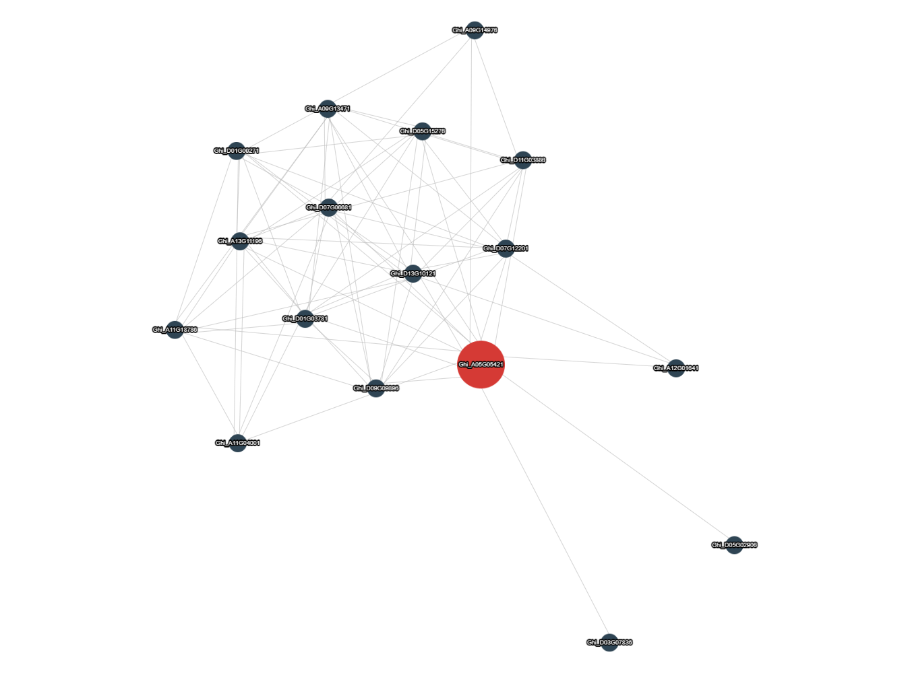

## Cytoscape.js简介

[Cytoscape.js](https://js.cytoscape.org/) 可用来绘制各种网络图, 其中[cola.js](https://js.cytoscape.org/demos/colajs-graph/)可以绘制gene与gene间的网络图。  
API文档参考<https://js.cytoscape.org/#getting-started>

## 示例



=== "JavaScript"

    ```html
    <script type="text/javascript" charset="utf8" src="http://code.jquery.com/jquery-1.10.2.min.js"></script>
    <script type="text/javascript" charset="utf8" src="http://yanglab.hzau.edu.cn/static/js/cytoscape.min.js"></script>

    <div style="width:1350px;height:1000px;" id="cy"></div>

    <script>
      $(document).ready(function() {
        var data = [
          //核心点
          { "data": { "id": "Ghi_A05G05421", "name": "Ghi_A05G05421", "score": 0.1 }, "style": { "background-color": "#D53A35" } },
          //其余点
          { "data": { "id": "Ghi_A11G18786", "name": "Ghi_A11G18786", "score": 0 }, "style": { "background-color": "#2F4554" } },
          { "data": { "id": "Ghi_A13G11196", "name": "Ghi_A13G11196", "score": 0 }, "style": { "background-color": "#2F4554" } },
          { "data": { "id": "Ghi_D03G07836", "name": "Ghi_D03G07836", "score": 0 }, "style": { "background-color": "#2F4554" } },
          { "data": { "id": "Ghi_D05G15276", "name": "Ghi_D05G15276", "score": 0 }, "style": { "background-color": "#2F4554" } },
          { "data": { "id": "Ghi_D11G03886", "name": "Ghi_D11G03886", "score": 0 }, "style": { "background-color": "#2F4554" } },
          { "data": { "id": "Ghi_D13G10121", "name": "Ghi_D13G10121", "score": 0 }, "style": { "background-color": "#2F4554" } },
          //边
          { "data": { "source": "Ghi_A05G05421", "target": "Ghi_A11G18786", "weight": 0.9422 } },
          { "data": { "source": "Ghi_A05G05421", "target": "Ghi_A13G11196", "weight": 0.9422 } },
          { "data": { "source": "Ghi_A05G05421", "target": "Ghi_D03G07836", "weight": 0.9409 } },
          { "data": { "source": "Ghi_A05G05421", "target": "Ghi_D05G15276", "weight": 0.9449 } },
          { "data": { "source": "Ghi_A05G05421", "target": "Ghi_D11G03886", "weight": 0.9477 } },
          { "data": { "source": "Ghi_A05G05421", "target": "Ghi_D13G10121", "weight": 0.9482 } },
          { "data": { "source": "Ghi_A11G18786", "target": "Ghi_A13G11196", "weight": 0.9638 } },
          { "data": { "source": "Ghi_A11G18786", "target": "Ghi_D13G10121", "weight": 0.9623 } },
          { "data": { "source": "Ghi_A13G11196", "target": "Ghi_D05G15276", "weight": 0.9558 } },
          { "data": { "source": "Ghi_A13G11196", "target": "Ghi_D13G10121", "weight": 0.9871 } },
          { "data": { "source": "Ghi_D05G15276", "target": "Ghi_D11G03886", "weight": 0.9537 } },
          { "data": { "source": "Ghi_D05G15276", "target": "Ghi_D13G10121", "weight": 0.9729 } }
        ]

        var cy = window.cy = cytoscape({
          container: document.getElementById('cy'),
          layout: {
            name: 'cose',
            idealEdgeLength: 100,
            nodeOverlap: 20,
            refresh: 20,
            fit: true,
            padding: 30,
            randomize: false,
            componentSpacing: 100,
            nodeRepulsion: 400000,
            edgeElasticity: 100,
            nestingFactor: 5,
            gravity: 80,
            numIter: 1000,
            initialTemp: 200,
            coolingFactor: 0.95,
            minTemp: 1.0
          },
          style: [{
            "selector": "core",
            "style": {
              "selection-box-color": "#AAD8FF",
              "selection-box-border-color": "#8BB0D0",
              "selection-box-opacity": "0.5"
            }
          }, {
            "selector": "node",
            "style": {
              "width": "mapData(score, 0, 0.1, 15, 40)",
              "height": "mapData(score, 0, 0.1, 15, 40)",
              "content": "data(name)",
              "font-size": "5px",
              "text-valign": "center",
              "text-halign": "center",
              "text-outline-width": "1px",
              "color": "#fff",
              "overlay-padding": "6px",
              "z-index": "10"
            }
          }, {
            "selector": "node[?attr]",
            "style": {
              "shape": "rectangle",
              "background-color": "#aaa",
              "text-outline-color": "#aaa",
              "width": "16px",
              "height": "16px",
              "font-size": "6px",
              "z-index": "1"
            }
          }, {
            "selector": "node[?query]",
            "style": {
              "background-clip": "none",
              "background-fit": "contain"
            }
          }, {
            "selector": "node:selected",
            "style": {
              "border-width": "6px",
              "border-color": "#AAD8FF",
              "border-opacity": "0.5",
              "background-color": "#77828C",
              "text-outline-color": "#77828C"
            }
          }, {
            "selector": "edge",
            "style": {
              "curve-style": "haystack",
              "haystack-radius": "0.5",
              "opacity": "0.6",
              "line-color": "#bbb",
              "overlay-padding": "3px",
              "width": 0.6
            }
          }, {
            "selector": "node.unhighlighted",
            "style": {
              "opacity": "0.2"
            }
          }, {
            "selector": "edge.unhighlighted",
            "style": {
              "opacity": "0.05"
            }
          }, {
            "selector": ".highlighted",
            "style": {
              "z-index": "999999"
            }
          }, {
            "selector": "node.highlighted",
            "style": {
              "border-width": "6px",
              "border-color": "#AAD8FF",
              "border-opacity": "0.5",
              "background-color": "#394855",
              "text-outline-color": "#394855"
            }
          }],
          elements: data
        });
      })
    </script>
    ```

=== "Vue"

    ```html
    <!-- npm install --save cytoscape -->
    <template>
      <div id="cy" style="width:1350px;height:1000px;"></div>
    </template>

    <script>
    import cytoscape from 'cytoscape'
    export default {
      name: 'example',
      components: {},
      data () {
        return {
          plotData: [
          { "data": { "id": "Ghi_A05G05421", "name": "Ghi_A05G05421", "score": 0.1 }, "style": { "background-color": "#D53A35" } },
          { "data": { "id": "Ghi_A11G18786", "name": "Ghi_A11G18786", "score": 0 }, "style": { "background-color": "#2F4554" } },
          { "data": { "id": "Ghi_A13G11196", "name": "Ghi_A13G11196", "score": 0 }, "style": { "background-color": "#2F4554" } },
          { "data": { "id": "Ghi_D03G07836", "name": "Ghi_D03G07836", "score": 0 }, "style": { "background-color": "#2F4554" } },
          { "data": { "id": "Ghi_D05G15276", "name": "Ghi_D05G15276", "score": 0 }, "style": { "background-color": "#2F4554" } },
          { "data": { "id": "Ghi_D11G03886", "name": "Ghi_D11G03886", "score": 0 }, "style": { "background-color": "#2F4554" } },
          { "data": { "id": "Ghi_D13G10121", "name": "Ghi_D13G10121", "score": 0 }, "style": { "background-color": "#2F4554" } },
          { "data": { "source": "Ghi_A05G05421", "target": "Ghi_A11G18786", "weight": 0.9422 } },
          { "data": { "source": "Ghi_A05G05421", "target": "Ghi_A13G11196", "weight": 0.9422 } },
          { "data": { "source": "Ghi_A05G05421", "target": "Ghi_D03G07836", "weight": 0.9409 } },
          { "data": { "source": "Ghi_A05G05421", "target": "Ghi_D05G15276", "weight": 0.9449 } },
          { "data": { "source": "Ghi_A05G05421", "target": "Ghi_D11G03886", "weight": 0.9477 } },
          { "data": { "source": "Ghi_A05G05421", "target": "Ghi_D13G10121", "weight": 0.9482 } },
          { "data": { "source": "Ghi_A11G18786", "target": "Ghi_A13G11196", "weight": 0.9638 } },
          { "data": { "source": "Ghi_A11G18786", "target": "Ghi_D13G10121", "weight": 0.9623 } },
          { "data": { "source": "Ghi_A13G11196", "target": "Ghi_D05G15276", "weight": 0.9558 } },
          { "data": { "source": "Ghi_A13G11196", "target": "Ghi_D13G10121", "weight": 0.9871 } },
          { "data": { "source": "Ghi_D05G15276", "target": "Ghi_D11G03886", "weight": 0.9537 } },
          { "data": { "source": "Ghi_D05G15276", "target": "Ghi_D13G10121", "weight": 0.9729 } }
        ]
        }
      },
      mounted () {
        this.$nextTick(function () {
          this.draw()
        })
      },
      methods: {
        draw () {
          var cy = cytoscape({
            container: document.getElementById('cy'),
            layout: {
              name: 'cose',
              idealEdgeLength: 100,
              nodeOverlap: 20,
              refresh: 20,
              fit: true,
              padding: 30,
              randomize: false,
              componentSpacing: 100,
              nodeRepulsion: 400000,
              edgeElasticity: 100,
              nestingFactor: 5,
              gravity: 80,
              numIter: 1000,
              initialTemp: 200,
              coolingFactor: 0.95,
              minTemp: 1.0
            },
            style: [
              {
                selector: 'core',
                style: {
                  'selection-box-color': '#AAD8FF',
                  'selection-box-border-color': '#8BB0D0',
                  'selection-box-opacity': '0.5'
                }
              },
              {
                selector: 'node',
                style: {
                  width: 'mapData(score, 0, 0.1, 15, 40)',
                  height: 'mapData(score, 0, 0.1, 15, 40)',
                  content: 'data(name)',
                  'font-size': '5px',
                  'text-valign': 'center',
                  'text-halign': 'center',
                  'text-outline-width': '1px',
                  color: '#fff',
                  'overlay-padding': '6px',
                  'z-index': '10'
                }
              },
              {
                selector: 'node[?attr]',
                style: {
                  shape: 'rectangle',
                  'background-color': '#aaa',
                  'text-outline-color': '#aaa',
                  width: '16px',
                  height: '16px',
                  'font-size': '6px',
                  'z-index': '1'
                }
              },
              {
                selector: 'node[?query]',
                style: {
                  'background-clip': 'none',
                  'background-fit': 'contain'
                }
              },
              {
                selector: 'node:selected',
                style: {
                  'border-width': '6px',
                  'border-color': '#AAD8FF',
                  'border-opacity': '0.5',
                  'background-color': '#77828C',
                  'text-outline-color': '#77828C'
                }
              },
              {
                selector: 'edge',
                style: {
                  'curve-style': 'haystack',
                  'haystack-radius': '0.5',
                  opacity: '0.6',
                  'line-color': '#bbb',
                  'overlay-padding': '3px',
                  width: 0.6
                }
              },
              {
                selector: 'node.unhighlighted',
                style: {
                  opacity: '0.2'
                }
              },
              {
                selector: 'edge.unhighlighted',
                style: {
                  opacity: '0.05'
                }
              },
              {
                selector: '.highlighted',
                style: {
                  'z-index': '999999'
                }
              },
              {
                selector: 'node.highlighted',
                style: {
                  'border-width': '6px',
                  'border-color': '#AAD8FF',
                  'border-opacity': '0.5',
                  'background-color': '#394855',
                  'text-outline-color': '#394855'
                }
              }
            ],
            elements: this.plotData
          })
          cy.minZoom(0.5)
          cy.maxZoom(3)
          cy.viewport({
            zoom: 1,
            pan: { x: 200, y: 200 }
          })
        }
      }
    }
    </script>
    ```