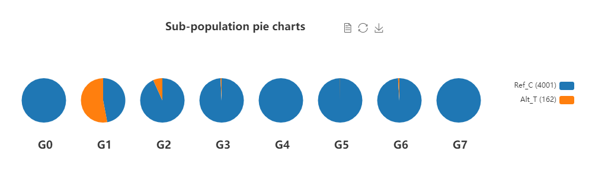

## Echarts 介绍
Echarts是基于 JavaScript 的开源可视化图表库, 详细图表配置可见[官网](https://echarts.apache.org/zh/index.html)。

常用图:

* 柱状图  
* 折线图
* 饼图  
* 散点图  
* 热图  

## 饼图组(多个饼图共用一套图例)



=== "JavaScript"

    ```html
    <script type="text/javascript" charset="utf8" src="http://code.jquery.com/jquery-1.10.2.min.js"></script>
    <script type="text/javascript" charset="utf8" src="https://cdn.jsdelivr.net/npm/echarts@5/dist/echarts.min.js"></script>

    <div id="pie_group" style="height:400px"></div>

    <script>
    $(document).ready(function() {
      draw_pie();
    });
    function draw_pie() {
      //获取所需数据
      var data = {
        G0: [
          {
            name: 'Ref_C',
            value: 39
          },
          {
            name: 'Alt_T',
            value: 0
          }
        ],
        G1: [
          {
            name: 'Ref_C',
            value: 111
          },
          {
            name: 'Alt_T',
            value: 125
          }
        ],
        G2: [
          {
            name: 'Ref_C',
            value: 290
          },
          {
            name: 'Alt_T',
            value: 21
          }
        ],
        G3: [
          {
            name: 'Ref_C',
            value: 534
          },
          {
            name: 'Alt_T',
            value: 4
          }
        ],
        G4: [
          {
            name: 'Ref_C',
            value: 794
          },
          {
            name: 'Alt_T',
            value: 0
          }
        ],
        G5: [
          {
            name: 'Ref_C',
            value: 725
          },
          {
            name: 'Alt_T',
            value: 1
          }
        ],
        G6: [
          {
            name: 'Ref_C',
            value: 1108
          },
          {
            name: 'Alt_T',
            value: 11
          }
        ],
        G7: [
          {
            name: 'Ref_C',
            value: 400
          },
          {
            name: 'Alt_T',
            value: 0
          }
        ],
        speicies: ["Ref_C", "Alt_T"]
      }
      //设置主标题以及副标题位置
      var title = [{
        text: 'Sub-population pie charts',
        subtextStyle: {
          color: 'black',
          fontSize: 15,
          fontWeight: 'bold'
        },
        x: '300'
      }, {
        text: 'G0',
        top: '80%',
        left: '8.5%',
      }, {
        text: 'G1',
        top: '80%',
        left: '18.5%',
      }, {
        text: 'G2',
        top: '80%',
        left: '28.5%',
      }, {
        text: 'G3',
        top: '80%',
        left: '38.5%',
      }, {
        text: 'G4',
        top: '80%',
        left: '48.5%',
      }, {
        text: 'G5',
        top: '80%',
        left: '58.5%',
      }, {
        text: 'G6',
        top: '80%',
        left: '68.5%',
      }, {
        text: 'G7',
        top: '80%',
        left: '78.5%',
      }
      ];
      sub_list = ['G0', 'G1', 'G2', 'G3', 'G4', 'G5', 'G6', 'G7'];
      for (var i = 0; i < sub_list.length; i++) {
        for (var j = 0; j < data[sub_list[i]].length; j++) {
          if (data[sub_list[i]][j]["value"] == 0) {
            data[sub_list[i]][j]["value"] = null;
          }
        }
      }
      var data0 = data['G0'];
      var data1 = data['G1'];
      var data2 = data['G2'];
      var data3 = data['G3'];
      var data4 = data['G4'];
      var data5 = data['G5'];
      var data6 = data['G6'];
      var data7 = data['G7'];
      var legend_data = data['speicies'];
      var colors = ["#1F77B4", "#FF7F0e", "#2CA02C", "#D62728", "#9467BD", "#8C564B", "#E377C2", "#7F7F7F", "#BCBD22", "#17BECF", "#9abeaf",
        "#999933", "#CC9966", "#D9D98C", "#BE0032", "#C2B280", "#848482", "#008856", "#E68FAC", "0067A5", "#F99379", "#604E97",
        "#F6A600", "#B3446C", "#DCD300", "#882D17", "#8DB600", "#654522", "#E25822", "#2B3D26", "#F2F3F4", "#222222"];
      //通过center属性设置饼图中心的位置，radius设置饼图大小
      var series0 = {
        name: 'G0',
        color: colors,
        type: 'pie',
        radius: '30%',
        center: ['10%', '55%'],
        itemStyle: {
          normal: {
            label: {
              show: false
            },
            labelLine: {
              show: false
            }
          },
          emphasis: {
            label: {
              show: false
            },
            labelLine: {
              show: false
            }
          }
        },
        data: data0
      }
      var series1 = $.extend(true, {}, series0);
      series1.name = "G1";
      series1.center = ['20%', '55%'];
      series1.data = data1;
      var series2 = $.extend(true, {}, series0);
      series2.name = "G2";
      series2.center = ['30%', '55%'];
      series2.data = data2;
      var series3 = $.extend(true, {}, series0);
      series3.name = "G3";
      series3.center = ['40%', '55%'];
      series3.data = data3;
      var series4 = $.extend(true, {}, series0);
      series4.name = "G4";
      series4.center = ['50%', '55%'];
      series4.data = data4;
      var series5 = $.extend(true, {}, series0);
      series5.name = "G5";
      series5.center = ['60%', '55%'];
      series5.data = data5;
      var series6 = $.extend(true, {}, series0);
      series6.name = "G6";
      series6.center = ['70%', '55%'];
      series6.data = data6;
      var series7 = $.extend(true, {}, series0);
      series7.name = "G7";
      series7.center = ['80%', '55%'];
      series7.data = data7;
      var myChart = echarts.init(document.getElementById('pie_group'))
      var option = {
        title: title,
        tooltip: {
          trigger: 'item',
          formatter: function(param) {
            return param.seriesName + " <br/>" + param.data.name.replace(/\s\(.*?\)/g, '') + " : " + String(param.data.value) + " (" + String(param.percent) + "%)";
          }
        },
        legend: {
          x: 'right',
          y: 'center',
          orient: 'vertical',
          data: legend_data
        },
        toolbox: {
          show: true,
          x: 600,
          feature: {
            mark: { show: true },
            dataView: { show: true, readOnly: false },
            magicType: {
              show: true,
              type: ['pie', 'funnel']
            },
            restore: { show: true },
            saveAsImage: { show: true, title: 'PNG' }
          }
        },
        calculable: true,
        series: [series0, series1, series2, series3, series4, series5, series6, series7]
      };
      myChart.setOption(option);
    }
    </script>
    ```

=== "Vue"

    ```html
    <!-- 命令行输入: `npm install echarts --save` 安装echarts -->
    <template>
      <div id="echart" style="width:900px;height:250px;"></div>
    </template>
    <script>
    import * as echarts from 'echarts'
    export default {
      name: 'pie_group_chart',
      data() {
        return {
          colors: ['#1F77B4','#FF7F0e','#2CA02C'],
          pie_data: {
            G0: [
              {
                name: 'Ref_C',
                value: 39
              },
              {
                name: 'Alt_T',
                value: 0
              }
            ],
            G1: [
              {
                name: 'Ref_C',
                value: 111
              },
              {
                name: 'Alt_T',
                value: 125
              }
            ],
            G2: [
              {
                name: 'Ref_C',
                value: 290
              },
              {
                name: 'Alt_T',
                value: 21
              }
            ],
            G3: [
              {
                name: 'Ref_C',
                value: 534
              },
              {
                name: 'Alt_T',
                value: 4
              }
            ],
            G4: [
              {
                name: 'Ref_C',
                value: 794
              },
              {
                name: 'Alt_T',
                value: 0
              }
            ],
            G5: [
              {
                name: 'Ref_C',
                value: 725
              },
              {
                name: 'Alt_T',
                value: 1
              }
            ],
            G6: [
              {
                name: 'Ref_C',
                value: 1108
              },
              {
                name: 'Alt_T',
                value: 11
              }
            ],
            G7: [
              {
                name: 'Ref_C',
                value: 400
              },
              {
                name: 'Alt_T',
                value: 0
              }
            ],
            speicies: ['Ref_C', 'Alt_T']
          }
        }
      },

      mounted() {
        this.draw_pie_chart()
      },

      methods: {
        draw_pie_chart() {
          var toolboxShow = true
          var legendposition = 800
          var legendposition_y = 'center'
          var title = [
            {
              text: 'Sub-population pie charts',
              subtextStyle: {
                color: 'black',
                fontSize: 15,
                fontWeight: 'bold'
              },
              x: '300'
            },
            {
              text: 'G0',
              top: '80%',
              left: '8.5%'
            },
            {
              text: 'G1',
              top: '80%',
              left: '18.5%'
            },
            {
              text: 'G2',
              top: '80%',
              left: '28.5%'
            },
            {
              text: 'G3',
              top: '80%',
              left: '38.5%'
            },
            {
              text: 'G4',
              top: '80%',
              left: '48.5%'
            },
            {
              text: 'G5',
              top: '80%',
              left: '58.5%'
            },
            {
              text: 'G6',
              top: '80%',
              left: '68.5%'
            },
            {
              text: 'G7',
              top: '80%',
              left: '78.5%'
            }
          ]
          var sub_list = ['G0', 'G1', 'G2', 'G3', 'G4', 'G5', 'G6', 'G7']
          var data = this.pie_data
          for (var i = 0; i < sub_list.length; i++) {
            for (var j = 0; j < data[sub_list[i]].length; j++) {
              if (data[sub_list[i]][j]['value'] == 0) {
                data[sub_list[i]][j]['value'] = null
              }
            }
          }
          var data0 = data['G0']
          var data1 = data['G1']
          var data2 = data['G2']
          var data3 = data['G3']
          var data4 = data['G4']
          var data5 = data['G5']
          var data6 = data['G6']
          var data7 = data['G7']

          var colors = this.colors
          var legend_data = this.pie_data.speicies

          var series0 = {
            name: 'G0',
            color: colors,
            type: 'pie',
            radius: '30%',
            center: ['10%', '55%'],
            itemStyle: {
              normal: {
                label: {
                  show: false
                },
                labelLine: {
                  show: false
                }
              },
              emphasis: {
                label: {
                  show: false
                },
                labelLine: {
                  show: false
                }
              }
            },
            data: data0
          }
          var series1 = JSON.parse(JSON.stringify(series0))
          series1.name = 'G1'
          series1.center = ['20%', '55%']
          series1.data = data1
          var series2 = JSON.parse(JSON.stringify(series0))
          series2.name = 'G2'
          series2.center = ['30%', '55%']
          series2.data = data2
          var series3 = JSON.parse(JSON.stringify(series0))
          series3.name = 'G3'
          series3.center = ['40%', '55%']
          series3.data = data3
          var series4 = JSON.parse(JSON.stringify(series0))
          series4.name = 'G4'
          series4.center = ['50%', '55%']
          series4.data = data4
          var series5 = JSON.parse(JSON.stringify(series0))
          series5.name = 'G5'
          series5.center = ['60%', '55%']
          series5.data = data5
          var series6 = JSON.parse(JSON.stringify(series0))
          series6.name = 'G6'
          series6.center = ['70%', '55%']
          series6.data = data6
          var series7 = JSON.parse(JSON.stringify(series0))
          series7.name = 'G7'
          series7.center = ['80%', '55%']
          series7.data = data7

          var myChart = echarts.init(document.getElementById('echart'))
          var option = {
            title: title,
            tooltip: {
              trigger: 'item',
              formatter: function(param) {
                return (
                  param.seriesName +
                  ' <br/>' +
                  param.data.name.replace(/\s\(.*?\)/g, '') +
                  ' : ' +
                  String(param.data.value) +
                  ' (' +
                  String(param.percent) +
                  '%)'
                )
              }
            },
            legend: {
              x: legendposition,
              y: legendposition_y,
              align: 'right',
              orient: 'vertical',
              data: legend_data
            },
            toolbox: {
              show: toolboxShow,
              x: 600,
              feature: {
                mark: { show: true },
                dataView: {
                  show: true,
                  title: 'Data view',
                  lang: ['Data view', 'close', 'refresh']
                },
                magicType: {
                  show: true,
                  type: ['pie', 'funnel']
                },
                saveAsImage: { show: true, title: 'save as png', name: 'chart' }
              }
            },
            calculable: true,
            series: [series0, series1, series2, series3, series4, series5, series6, series7]
          }
          myChart.clear()
          this.$nextTick(function() {
            myChart.resize({
              width: this.width,
              height: this.height
            })
            myChart.setOption(option)
          })
        }
      }
    }
    </script>
    ```