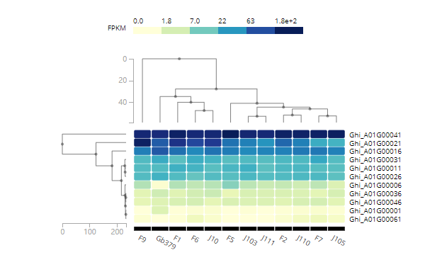

GTEx官网: <https://github.com/broadinstitute/gtex-viz>

## 示例



=== "JavaScript"

    ```html
    <link rel="stylesheet" type="text/css" href="http://yanglab.hzau.edu.cn/gtex-viz/css/expressMap.css">
    <script type="text/javascript" charset="utf8" src="http://code.jquery.com/jquery-1.10.2.min.js"></script>
    <script type="text/javascript" charset="utf8" src="http://yanglab.hzau.edu.cn/gtex-viz/build/js/gtex-viz.bundle.min.js"></script>

    <div id="userDendroHeatmap"></div>

    <script>
      $(document).ready(function() {
        //载入数据包括行与列的nwk格式的聚类树以及heatmap值
        var data = {
          rowTree: "(((TP53:0.17,SLK:0.17):1.18,NDRG4:1.34):1.33,ACTN3:2.67);",
          colTree: "(((Adipose Visceral Omentum:0.06,Adipose Subcutaneous:0.06):0.00,Bladder:0.06):0.16,Adrenal Gland:0.22);",
          heatmap: [
            {
              "y": "SLK",
              "value": 35.505,
              "x": "Adipose Subcutaneous",
              "unit": "TPM"
            },
            {
              "y": "SLK",
              "value": 29.28,
              "x": "Adipose Visceral Omentum",
              "unit": "TPM"
            },
            {
              "y": "SLK",
              "value": 17.405,
              "x": "Adrenal Gland",
              "unit": "TPM"
            },
            {
              "y": "SLK",
              "value": 53.29,
              "x": "Bladder",
              "unit": "TPM"
            },
            {
              "y": "NDRG4",
              "value": 12.035,
              "x": "Adipose Subcutaneous",
              "unit": "TPM"
            },
            {
              "y": "NDRG4",
              "value": 6.531000000000001,
              "x": "Adipose Visceral Omentum",
              "unit": "TPM"
            },
            {
              "y": "NDRG4",
              "value": 134.8,
              "x": "Adrenal Gland",
              "unit": "TPM"
            },
            {
              "y": "NDRG4",
              "value": 7.1160000000000005,
              "x": "Bladder",
              "unit": "TPM"
            },
            {
              "y": "TP53",
              "value": 29.935,
              "x": "Adipose Subcutaneous",
              "unit": "TPM"
            },
            {
              "y": "TP53",
              "value": 23.55,
              "x": "Adipose Visceral Omentum",
              "unit": "TPM"
            },
            {
              "y": "TP53",
              "value": 18.515,
              "x": "Adrenal Gland",
              "unit": "TPM"
            },
            {
              "y": "TP53",
              "value": 40.51,
              "x": "Bladder",
              "unit": "TPM"
            },
            {
              "y": "ACTN3",
              "value": 0.33145,
              "x": "Adipose Subcutaneous",
              "unit": "TPM"
            },
            {
              "y": "ACTN3",
              "value": 0.3317,
              "x": "Adipose Visceral Omentum",
              "unit": "TPM"
            },
            {
              "y": "ACTN3",
              "value": 0.100005,
              "x": "Adrenal Gland",
              "unit": "TPM"
            },
            {
              "y": "ACTN3",
              "value": 0.48100000000000004,
              "x": "Bladder",
              "unit": "TPM"
            }
          ]
        }

        var config = {
          id: 'userDendroHeatmap',
          data: data,
          useLog: true,
          logBase: 10,
          width: 600, // outer width
          height: 300, // outer height
          marginLeft: 20,
          marginRight: 40,
          marginTop: 50,
          marginBottom: 50,
          rowTreePanelWidth: 100,
          colTreePanelHeight: 100,
          colorScheme: "Blues",
          cornerRadius: 2,
          columnLabelHeight: 200,
          columnLabelAngle: 60,
          columnLabelPosAdjust: 10,
          rowLabelWidth: 200,
          legendSpace: 50
        };
        GTExViz.dendroHeatmap(config);
      })
    </script>
    ```

=== "Vue"

    !!! Tip
        以下示例中, gtex-viz.bundle.vue.min.js存放在public/js中, pop_exp.css、expressMap.css存放在public/css中。  
        其中, gtex-viz.bundle.vue.min.js文件使用<http://yanglab.hzau.edu.cn/static/js/gtex-viz.bundle.vue.min.js>。  

    ```html
    <template>
      <div id="userDendroHeatmap"></div>
    </template>

    <script>
    import { GTExViz } from '@/../public/js/gtex-viz.bundle.vue.min.js'
    export default {
      name: 'example',
      components: {},
      data () {
        return {
          plotData: {
            rowTree: '(((TP53:0.17,SLK:0.17):1.18,NDRG4:1.34):1.33,ACTN3:2.67);',
            colTree:
              '(((Adipose Visceral Omentum:0.06,Adipose Subcutaneous:0.06):0.00,Bladder:0.06):0.16,Adrenal Gland:0.22);',
            heatmap: [
              {
                y: 'SLK',
                value: 35.505,
                x: 'Adipose Subcutaneous',
                unit: 'TPM'
              },
              {
                y: 'SLK',
                value: 29.28,
                x: 'Adipose Visceral Omentum',
                unit: 'TPM'
              },
              {
                y: 'SLK',
                value: 17.405,
                x: 'Adrenal Gland',
                unit: 'TPM'
              },
              {
                y: 'SLK',
                value: 53.29,
                x: 'Bladder',
                unit: 'TPM'
              },
              {
                y: 'NDRG4',
                value: 12.035,
                x: 'Adipose Subcutaneous',
                unit: 'TPM'
              },
              {
                y: 'NDRG4',
                value: 6.531000000000001,
                x: 'Adipose Visceral Omentum',
                unit: 'TPM'
              },
              {
                y: 'NDRG4',
                value: 134.8,
                x: 'Adrenal Gland',
                unit: 'TPM'
              },
              {
                y: 'NDRG4',
                value: 7.1160000000000005,
                x: 'Bladder',
                unit: 'TPM'
              },
              {
                y: 'TP53',
                value: 29.935,
                x: 'Adipose Subcutaneous',
                unit: 'TPM'
              },
              {
                y: 'TP53',
                value: 23.55,
                x: 'Adipose Visceral Omentum',
                unit: 'TPM'
              },
              {
                y: 'TP53',
                value: 18.515,
                x: 'Adrenal Gland',
                unit: 'TPM'
              },
              {
                y: 'TP53',
                value: 40.51,
                x: 'Bladder',
                unit: 'TPM'
              },
              {
                y: 'ACTN3',
                value: 0.33145,
                x: 'Adipose Subcutaneous',
                unit: 'TPM'
              },
              {
                y: 'ACTN3',
                value: 0.3317,
                x: 'Adipose Visceral Omentum',
                unit: 'TPM'
              },
              {
                y: 'ACTN3',
                value: 0.100005,
                x: 'Adrenal Gland',
                unit: 'TPM'
              },
              {
                y: 'ACTN3',
                value: 0.48100000000000004,
                x: 'Bladder',
                unit: 'TPM'
              }
            ]
          }
        }
      },
      mounted () {
        this.$nextTick(function () {
          this.draw()
        })
      },
      methods: {
        draw () {
          const config = {
            id: 'userDendroHeatmap',
            data: this.plotData,
            useLog: true,
            logBase: 10,
            width: 600,
            height: 300,
            marginLeft: 20,
            marginRight: 40,
            marginTop: 50,
            marginBottom: 50,
            rowTreePanelWidth: 100,
            colTreePanelHeight: 100,
            colorScheme: 'Blues',
            cornerRadius: 2,
            columnLabelHeight: 200,
            columnLabelAngle: 60,
            columnLabelPosAdjust: 10,
            rowLabelWidth: 200,
            legendSpace: 50
          }
          GTExViz.dendroHeatmap(config)
        }
      }
    }
    </script>

    <style scoped>
    /* 使用本页面到css文件的相对路径, 需自行调整 */
    @import '../../../public/css/pop_exp.css';
    @import '../../../public/css/expressMap.css';
    </style>
    ```