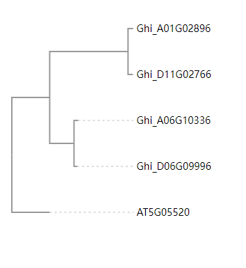

## 使用phylotree.js绘制进化树



=== "JavaScript"

    !!! Tip
        nwk示例文件: AT2G01080_mafft.nwk  

        ```vim
        ((((Ghi_A01G00036:0.00053,Ghi_D01G00036:0.01923)0.995:0.09853,(Ghi_A03G13296:0.01822,Ghi_D02G12776:0.00318):0.04347)0.894:0.08498,(Ghi_A05G09376:0.11190,Ghi_D05G04441:0.03452)1.000:1.44064)0.610:0.06912,AT2G01080:0.06912);
        ```
    ```html
    <link rel="stylesheet" type="text/css" href="http://yanglab.hzau.edu.cn/static/resource_js/exp/phylotree.css">
    <link rel="stylesheet" type="text/css" href="http://yanglab.hzau.edu.cn/static/css/bootstrap.min.css">
    <script type="text/javascript" charset="utf8" src="http://code.jquery.com/jquery-1.10.2.min.js"></script>
    <script type="text/javascript" charset="utf8" src="http://yanglab.hzau.edu.cn/static/resource_js/exp/d3.v3.min.js"></script>
    <script type="text/javascript" charset="utf8" src="http://yanglab.hzau.edu.cn/static/js/underscore-min.js"></script>
    <script type="text/javascript" charset="utf8" src="http://yanglab.hzau.edu.cn/static/resource_js/exp/phylotree.js"></script>

    <div>
      <svg id="tree_display" style="width:320px"></svg>
    </div>

    <script>
      $(document).ready(function() {
        var file_name = './AT2G01080_mafft.nwk'; //加载nwk进化树文件，自行修改文件路径
        d3.text(file_name, function(error, newick) {
          var height = 550,
            width = 290,
            tree = d3.layout.phylotree()
              .svg(d3.select("#tree_display"))
              .options({
                'left-right-spacing': 'fit-to-step',
                'top-bottom-spacing': 'fit-to-size',
                'selectable': true,
                'reroot': false,
                'hide': false,
                'show-scale': false
              })
              .align_tips(true)
              .font_size(14)
              .size([height, width])
              .node_circle_size(0);
          tree(newick).layout();
          function my_node_style_text(node) {
            node['text-italic'] = !node['text-italic'];
            d3.layout.phylotree.trigger_refresh(tree);
          }
          function my_menu_title(node) {
            if (node['text-italic']) {
              return "Remove Italics";
            }
            return "Custom function";
          }
          tree.get_nodes()
            .filter(d3.layout.phylotree.is_leafnode)
            .forEach(function(tree_node) {
              d3.layout.phylotree.add_custom_menu(tree_node, // add to this node
                my_menu_title, // display this text for the menu
                function() { //Custom function
                  console.log(tree_node['name'])
                },
                d3.layout.phylotree.is_leafnode
              );
            });
        })
      })
    </script>
    ```

=== "Vue"

    !!! Tip
        以下示例中, underscore-vue-min.js、phylotree-vue.js存放在public/js中, phylotree.css存放在public/css中, nwk文件放在public文件夹中。  
        其中, underscore.js文件使用<http://yanglab.hzau.edu.cn/static/js/underscore-vue-min.js>。  
        其中, phylotree.js文件使用<http://yanglab.hzau.edu.cn/static/js/phylotree-vue.js>。

    ```html
    <template>
      <div>
        <svg id="tree_display" style="width:300px;"></svg>
      </div>
    </template>

    <script>
    /* eslint-disable */
    import { phylotree } from '@/../public/js/phylotree-vue.js'
    export default {
      name: 'tree',
      components: {},
      data() {
        return {}
      },
      mounted() {
        this.$nextTick(function() {
          this.draw()
        })
      },
      methods: {
        draw() {
          var file_name = './AT2G01080_mafft.nwk'
          var that = this
          d3.text(file_name, function(error, newick) {
            if (error) {
              that.error_show = true
              return
            } else {
              that.error_show = false
            }
            var height = 500,
              width = 290,
              tree = d3.layout
                .phylotree()
                .svg(d3.select('#tree_display'))
                .options({
                  'left-right-spacing': 'fit-to-step',
                  'top-bottom-spacing': 'fit-to-size',
                  selectable: true,
                  reroot: false,
                  hide: false,
                  'show-scale': false
                })
                .align_tips(true)
                .font_size(14)
                .size([height, width])
                .node_circle_size(0)
            tree(newick).layout()
            function my_menu_title(node) {
              if (node['text-italic']) {
                return 'Remove Italics'
              }
              return 'console.log  ' + node['name']
            }
            tree
              .get_nodes()
              .filter(d3.layout.phylotree.is_leafnode)
              .forEach(function(tree_node) {
                d3.layout.phylotree.add_custom_menu(
                  tree_node, // add to this node
                  my_menu_title, // display this text for the menu
                  function() {
                    console.log(tree_node['name'])
                  },
                  d3.layout.phylotree.is_leafnode
                )
              })
            var tree_arr = tree.get_nodes()
            var genes = []
            tree_arr.forEach(function(eachnode) {
              if (tree.is_leafnode(eachnode)) {
                genes.push(eachnode.name)
              }
            })
            that.genes = genes.join(',')
          })
        }
      }
    }
    </script>

    <style scoped>
    /* 使用进化树页面到css文件的相对路径, 需自行调整 */
    @import '../../../public/css/phylotree.cs';
    </style>
    ```