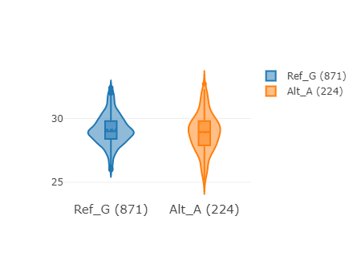

## plotly.js 介绍
[plotly.js](https://plotly.com/javascript/) 中有绘制小提琴图的模块, 具体配置查看[手册](https://plotly.com/javascript/violin/)。

## violin plot 示例



=== "JavaScript"

    ```html
    <script type="text/javascript" charset="utf8" src="http://code.jquery.com/jquery-1.10.2.min.js"></script>
    <script type="text/javascript" charset="utf8" src="https://cdn.plot.ly/plotly-2.4.2.min.js"></script>

    <div id="plotchart" style="width:500px;height:400px;margin-left:310px;margin-top:50px"></div>
    <script>
    $(document).ready(function() {
      draw()
    })
    function draw() {
      var x = ["Ref_G", "Ref_G", "Ref_G", "Ref_G", "Ref_G", "Ref_G", "Alt_A", "Alt_A", "Alt_A", "Alt_A", "Alt_A", "Alt_A"]
      var y = [29.9, 29.9, 27.3, 29.7, 29.8, 27.8, 29.4, 29.2, 28.4, 28.3, 28.5, 27.8]
      var data = [{
        type: 'violin',
        x: x,
        y: y,
        points: 'none',
        box: {
          visible: true
        },
        line: {
          color: 'green',
        },
        meanline: {
          visible: true
        },
        transforms: [{
          type: 'groupby',
          groups: x,
          styles: [{
            target: 'Ref_G',
            value: {
              line: {
                color: '#1F77B4'
              }
            }
          },
          {
            target: 'Alt_A',
            value: {
              line: {
                color: '#FF7F0e'
              }
            }
          },
          ]
        }]
      }]
      var layout = {
        height: 330,
        width: 450,
        margin: {
          t: 80
        },
        title: {
          text: 'violin plot'
        },
        yaxis: {
          zeroline: false
        },
        /* legend: {
            "orientation": "h"
        } */
      }
      Plotly.newPlot('plotchart', data, layout);
    }
    </script>
    ```

=== "Vue"
    ```html
    <!-- npm i --save plotly.js-dist-min -->
    <template>
      <div id="chartDiv"></div>
    </template>
    <script>
    import Plotly from 'plotly.js-dist-min'
    export default {
      name: 'violin',
      data() {
        return {
          colors1: ['#1F77B4', '#FF7F0e', '#2CA02C', '#D62728', '#9467BD'],
          colors2: ['#003300', '#669933', '#cccc99', '#666600', '#CCCC66'],
          chartTitle: 'violin plot',
          fontsize: 15,
          color_style: 'colors1',
          chartData: {
            x: ["Ref_G", "Ref_G", "Ref_G", "Ref_G", "Ref_G", "Ref_G", "Alt_A", "Alt_A", "Alt_A", "Alt_A", "Alt_A", "Alt_A"],
            y: [29.9, 29.9, 27.3, 29.7, 29.8, 27.8, 29.4, 29.2, 28.4, 28.3, 28.5, 27.8]
          }
        }
      },
      mounted: function() {
        this.draw_chart()
      },
      methods: {
        draw_chart() {
          var that = this
          var x = that.chartData.x
          var y = that.chartData.y
          var x_type = Array.from(new Set(x))
          var styles = new Array()
          for (let i = 0; i < x_type.length; i++) {
            styles.push({
              target: x_type[i],
              value: { line: { color: that[that.color_style][i] } }
            })
          }
          var width_pic = x_type.length * 250 > 1000 ? 1000 : x_type.length * 250
          width_pic = width_pic < 350 ? 350 : width_pic
          var title = this.chartTitle
          var data = [
            {
              type: 'violin',
              x: x,
              y: y,
              points: 'none',
              box: {
                visible: true
              },
              line: {
                color: 'green'
              },
              meanline: {
                visible: true
              },
              transforms: [
                {
                  type: 'groupby',
                  groups: x,
                  styles: styles
                }
              ]
            }
          ]
          var layout = {
            height: 330,
            width: width_pic,
            margin: {
              t: 80
            },
            title: {
              text: title
            },
            xaxis: {
              tickfont: {
                size: that.fontsize
              }
            },
            yaxis: {
              zeroline: false
            }
          }
          Plotly.newPlot('chartDiv', data, layout)
        }
      }
    }
    </script>
    ```