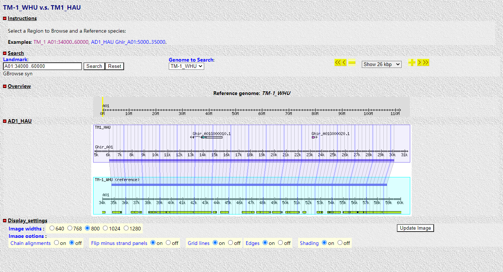

## GBrowse syn 安装

官网: <http://gmod.org/wiki/GBrowse_syn>  
下载安装: <https://github.com/GMOD/GBrowse>

## GBrowse syn 配置

在安装步骤中最后一步生成的gbrowse.conf文件中找到GBROWSE_CONF设置的路径, 在该路径中找到synteny目录，其中放置配置文件。

此为官方提供的一个教程<http://gmod.org/wiki/GBrowse_syn_Tutorial#The_GBrowse_syn_Config_File>

## 配置实例

1. 本实例已安装好GBrowse syn, 配置文件存放在/etc/gbrowse/synteny目录中。  
2. 本实例为棉花中的TM-1_WHU与A1_WHU两个基因组的比对。  
3. 首先准备TM-1_WHU与A1_WHU的gff注释文件。  
   第七步中配置conf文件中的balloon hover气泡栏需要gff文件中**mRNA行**有gene **Name**。  
   gff文件头部格式如下：
   ```
   ##gff-version 3
   ##sequence-region A01 1 112577161
   ##sequence-region A02 1 104266397
   ##sequence-region A03 1 105393268
   ...
   ```
4. 准备TM-1_WHU与A1_WHU的CLUSTALW格式的比对文件  
   示例文件:
   ```shell
   $ zcat rice.aln.gz | head -20

   CLUSTAL W(1.81) multiple sequence alignment W(1.81)


   rice-3(+)/16598648-16600199      ggaggccggccgtctgccatgcgtgagccagacggggcgggccggagacaggccacgtgg
   wild_rice-3(+)/14467855-14469373 gggggccgg------------------------------------agacaggccacgtgg
                                    ** ******                                    ***************


   rice-3(+)/16598648-16600199      ccctgccccgggctgttgacccactggcacccctgtcccgggttgtcgccctcctttccc
   wild_rice-3(+)/14467855-14469373 ccctgccccgggctgttgacccactggcacccctgtcccgggttgtcgccctcctttccc
                                    ************************************************************


   rice-3(+)/16598648-16600199      cgccatgctctaagtttgctcctcttctcgaacttctctctttgattcttcacgtcctct
   wild_rice-3(+)/14467855-14469373 cgccatgctctaagtttgctcctcttctcgaacttctctctttgattcttcacgtcctct
                                    ************************************************************


   rice-3(+)/16598648-16600199      tggagcctccccttctagctcgatcacgctctgctcttccgcttggaggctggcaaaact
   wild_rice-3(+)/14467855-14469373 tggagcctccccttctagctcgatcgcgctctgctcttccgcttggaggctggcaaaact
   ```
5. mysql中创建数据库  
   ```sql
   create database TM_1_WHU_VS_A1_WHU;
   grant SELECT on TM_1_WHU_VS_A1_WHU.* to 'www-data'@'localhost';

   create database TM_1_WHU;
   grant SELECT on TM_1_WHU.* to 'www-data'@'localhost';

   create database A1_WHU;
   grant SELECT on A1_WHU.* to 'www-data'@'localhost';
   ```
6. 导入数据
   ```shell
   #使用gbrowse中的gbrowse_syn_load_alignments_msa.pl程序导入比对数据
   # -u mysql的用户名
   # -p mysql的密码
   # -d 数据库名
   # -c 比对数据文件
   path_to_gbrowse/bin/gbrowse_syn_load_alignments_msa.pl -u user -p password -d TM_1_WHU_VS_A1_WHU -v -c TM_1_WHU_VS_A1_WHU.aln

   #使用bp_seqfeature_load导入gff注释文件
   #-d中的mysql_socket指的是mysql的socket文件存放路径, 没有修改过其路径则不需要填写
   bp_seqfeature_load -u user -p password -d dbi:mysql:TM_1_WHU:mysql_socket=/store/db_save/run/mysqld.sock -c -f TM_1_WHU.gff3
   bp_seqfeature_load -u user -p password -d dbi:mysql:A1_WHU:mysql_socket=/store/db_save/run/mysqld.sock -c -f A1_WHU.gff3
   ```
7. 在/etc/gbrowse/synteny中创建配置文件  
   TM-1_WHU_A1_WHU.synconf:
   ```
   [GENERAL]
   description = TM-1_WHU v.s. A1_WHU
   # The synteny database
   join        = dbi:mysql:database=TM_1_WHU_VS_A1_WHU;host=localhost;user='www-data';mysql_socket=/store/db_save/run/mysqld.sock
   #                 symbolic src   config file (".conf")    Description
   source_map =      TM_1_WHU           TM_1_WHU             "TM-1_WHU"
                     A1_WHU             A1_WHU               "A1_WHU"

   # web site configuration info
   tmpimages     = /tmp/gbrowse
   imagewidth    = 800
   stylesheet    = /static/css/gbrowse/gbrowse_transparent.css

   # The extension of species config files
   # can also use .syn (the default)
   config_extension = conf

   # example searches to display
   examples = TM_1_WHU A01:95800..145799
              A1_WHU Chr07:90330000..90369999

   zoom levels = 5000 10000 25000 50000 100000 200000 400000 1000000

   # species-specific databases
   [TM_1_WHU]
   tracks    = CG CG:TE
   color     = cyan

   [A1_WHU]
   tracks    = CG CG:TE
   color     = mediumslateblue
   ```
   TM_1_WHU.conf (A1_WHU.conf仿照TM_1_WHU.conf改写):
   ```
   [GENERAL]
   description   = TM-1_WHU
   db_adaptor    = Bio::DB::SeqFeature::Store
   db_args       = -adaptor DBI::mysql
                   -dsn dbi:mysql:TM_1_WHU:mysql_socket=/store/db_save/run/mysqld.sock

   tmpimages   = /tmp/gbrowse

   [CG]
   label        = 1
   description  = 1
   feature      = mRNA
   category     = Genes
   glyph        = processed_transcript
   font2color   = blue
   height       = 6
   key          = mRNA
   bgcolor      = sub {
     my $flip = pop->panel->flip;
     my $strand = shift->strand;
     return $strand < 0 ? 'violet' : 'turquoise' if $flip;
     return $strand > 0 ? 'violet' : 'turquoise';
   }
   balloon hover = $method: $name $ref:$start.. $end

   [CG:TE]
   label        = 1
   description  = 1
   feature      = TE
   category     = Genes
   font2color   = #DEE520
   height       = 6
   key          = TE
   bgcolor      = #DAF409
   balloon hover = $method: $name $ref:$start.. $end

   # draw genes differently for segments > 100Kb
   [CG:100001]
   label        = 0
   description  = 0
   glyph        = generic
   strand_arrow = 1
   ```
