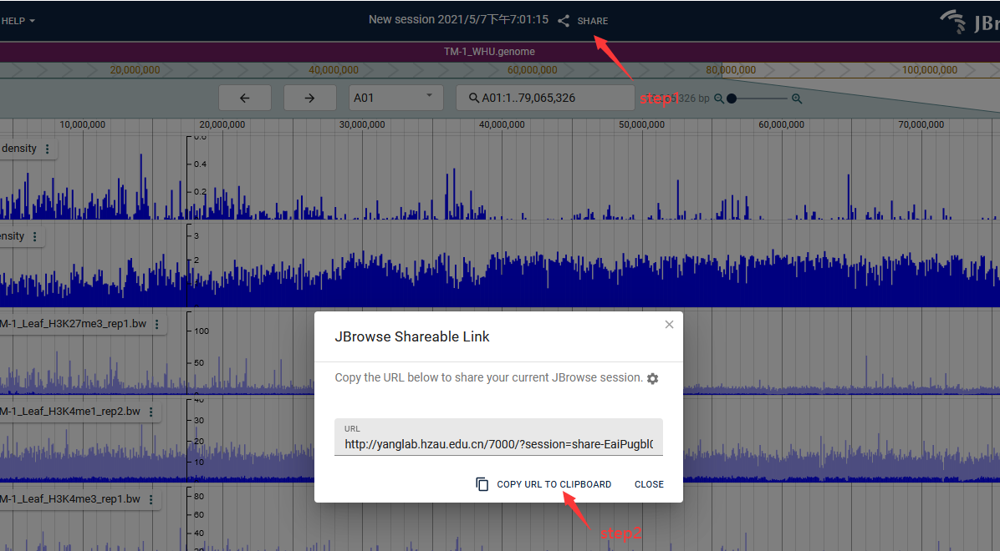

## JBrowse 2简介

JBrowse2 与 JBrowse1的差异可见<https://jbrowse.org/jb2/features/>。  
!!! note
    在JBrowse2中不支持URL交互。

## 安装配置

根据此页面进行安装配置: <https://jbrowse.org/jb2/docs/combined/>。

以下为[cottonMD](http://yanglab.hzau.edu.cn/7000/?session=share-e4O6h_RR4p&amp;password=3IlvC)中棉花的配置文件, 可作为参考: <http://yanglab.hzau.edu.cn/static/jbr_conf/config.json>。

## 其它

### 通过jbrowse2中的分享功能可以设置默认页面


!!! note
    直接复制页面url链接无法保存当前jbr页面。

### 设置后台运行

```shell
#查看所有会话
screen -ls
#创建
screen -S jbrowse2
#进入会话
screen -r jbrowse2
#在jbrowse2安装目录中运行以下命令将会在7000端口启动jbrowse2
npx serve -l 7000 .
#退出
screen -d jbrowse2
```